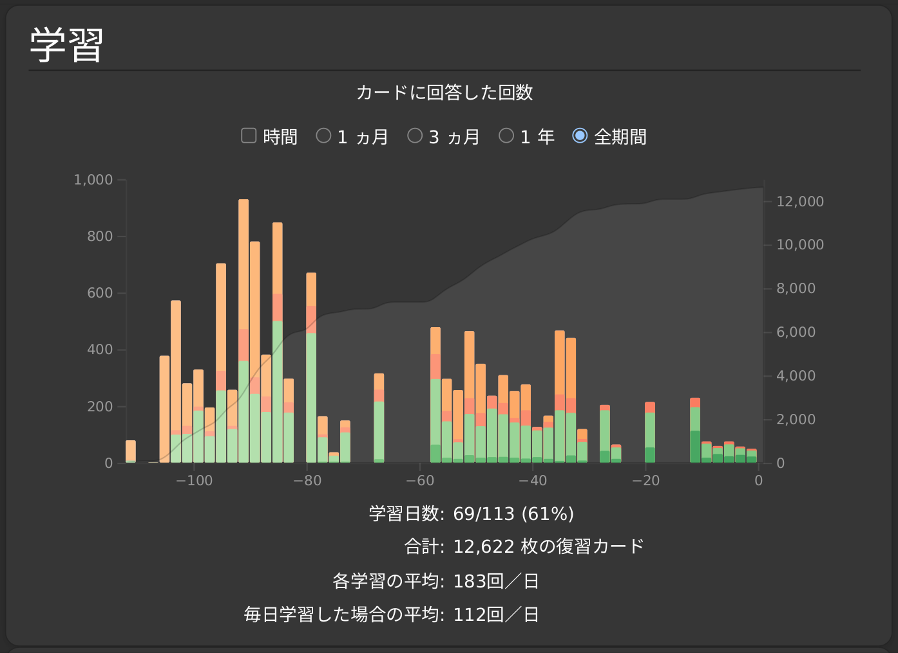
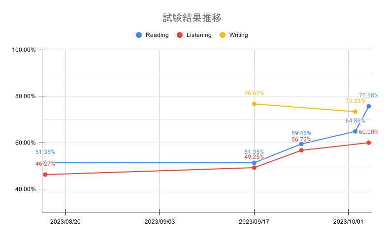
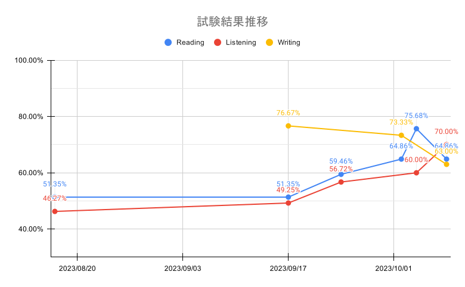

+++
title = "英検準2級への挑戦"
date = 2023-10-23T16:23:00+09:00
tags = ['体験記']
+++

## 経緯
英語の必要性は高専1年生の夏休み頃から感じました。多くの情報は英語で得ることができます。英語で検索できるのとできないのでは、天と地の差があるといってもいいのではないでしょうか？しかし、私は英語に非常に苦手意識があります。中学3年生の時にギリギリ英検3級を受かったレベルです。  
そこで高専2年生になったらTOEICを受けようと考えていました。高専1年生の3月、いざTOEICの過去問を解いてみると、ほとんどわかりませんでした。そこでまずは単語力をつけようと、「TOEIC L＆R TEST 出る単特急 銀のフレーズ」をはじめました。高専2年の5月、数百問覚えたところで、もう一度TOEICの過去問を解いてみましたが、ほとんど成長がありませんでした。更にリスニングはほぼ全く聞き取ることができませんでした。自分にはTOEICのレベルは高すぎると自覚しました。  
そこで高専2年の6月、英検準2級を受験するという方針に変更しました。というのが英検準2級を受験するまでの経緯です。英検準2級なんて低い級を受けるのかと言われるかもしれませんが、今の自分にちょうどよい級だと考えています。英語が苦手だからといって何もせずに終わるのではなく、諦めるにしても、挑戦してから諦めたい！！

## 2023/06/XX:勉強開始
まずは語彙力を強化するために、単語帳を進めました。Ankiというアプリを使用して単語を覚えました。その後、過去問をときました。リスニング力がたりなさすぎるため、音読等をがんばりました。

## 2023/10/08:一次試験当日
雨男の力により、一次試験当日、安定の雨でした。試験終了後の感想として、ライティングがいつもよりできませんでした。ライティングのお題が難しすぎて、日本語でも説明が思いつきませんでした。ライティングの失敗を引きずり、リスニングの初めの10問は集中できませんでした。手応えなしです。。。

一次試験が終わったので、どれぐらい勉強を頑張ったか振り返っておきます。下の写真は、一次試験当日までの単語アプリの使用状況です。期末テスト、セキュリティ・キャンプがある期間は全然勉強していませんが、それ以外は結構継続できているようです。よく頑張った！

単語は比較的継続できていましたが、英検全体の勉強は思うように進みませんでした。下の写真は、英検の過去問の点数をグラフ化したものです。ライティングはChatGPTに採点してもらいました。グラフを見てわかるとおり、8月17日から9月17日までの一ヶ月間でほぼ点数が上がっていません。9月17日以降の半月で頑張って合格点を超えるぐらいまで持ってきています。つまり実質的に英検の勉強(単語以外の音読、速読等の勉強)は最後の半月で追い込んだことになります。もう少し余裕を持ってコツコツしたいと感じました。

## 2023/10/23:一次試験合格発表
いよいよ合格発表の日です。恐る恐る結果を見ると、「合格」の文字があるではありませんか！！嬉しい！！  
合格基準が1322点の問題で、1345点で合格していました。いやギリギリすぎる（笑）。もう少しいい点で合格したかったです。予想通り、ライティング問題の点数が普段よりは低かったです。下の写真は試験の結果も含めた点数の推移のグラフです。   

二次試験合格に向けて頑張りたいです。 

## 2023/11/12:二次試験当日
一次試験の合格発表から3週間ほどが経ち、ついに二次試験の日がやってきました。  
会場には一番に到着し、面接も一番はじめに行いました。問1,2,3はそこそこできたと思います。しかし問4と問5の自分の意見を述べる問題でだいぶテンパりました。なんとか設問を聞き取ることができたのですが、答える内容が日本語でも思いつきませんでした。挙句の果、文法がメチャクチャな状態で回答してしまいました... やらかしてしまいました...

二次試験が終わったので、勉強してきた内容を振り返ってみます。自分で面接の練習を10回分行い、英語の先生にも協力してもらい3回分、計13回分練習しました。英語の聞き取りでは何回か聞き直すことで、聞き取れるレベルでした。自分の意見を述べる部分では、語彙力の少なさと、知ってる語彙でも使えない語彙(瞬時に出てこない英語)が多いことに気が付きました。ひたすら使える語句を増やすトレーニングをしました。後半はなかなか上達せず、モチベーションを維持するのが大変でした。

## 2023/11/21:二次試験合格発表
待ちに待った、合格発表の時がやってきました。  
結果は「合格」でした。600点中424点とギリギリでしたが、なんとか合格することができました！!  
英検準2級合格で止まるのではなく、もっともっと勉強していきたいです！

