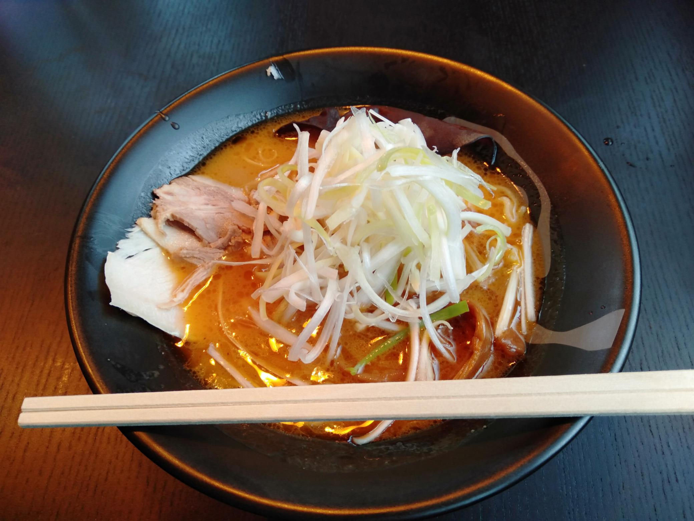

+++
title = "2023 後期中間テスト"
date = 2023-12-06T16:24:00+09:00
tags = ['日記']
+++

## テスト期間中の出来事
### KSECセキュリティコンテスト
11月18日に「[KOSENセキュリティコンテスト2023](https://www.kisarazu.ac.jp/k-sec/kosen_securitycontest_2023/)」がありました。多分初めて申し込んでCTFに参加しました。(セキュリティのイベントの一つとして開かれるCTFを除く)。このコンテストでは1チーム最大4人参加できるそうです。私は私しかいない「Polaris」というチーム名で出場しました。メンバーを集めなかったのは、自分の趣味として楽しむためです。実はこの期間、中間テスト期間真っ最中のため、遊び半分で参加するのに、友達を誘うのは申し訳ないなという気持ちがありました。問題を特にあたって新しい技術や、新しい知見を手に入れられればよいなという軽い気持ちで参加しまた。  

コンテストが始まりました。当日は寮から参加していました。午前中はみんな睡眠中のためかインターネットの回線が早くストレス無く競技に集中できました。しかし午後から、徐々に回線が重くなり、何度もVPNの接続が切れるようになってきました。問題のファイルをダウンロードしたり、ソフトウェアのダウンロードや、ネットサーフィンがサクサクできず、とてもストレスを感じました。  

結果的に、順位はほぼ真ん中でした。後2時間あれば300point取れて、トップ10位以内に入れそうでした。  

完全に実力不足でした。簡単な問題は解けましたが、高得点の問題は全然解けませんでした。バイナリ問題をもうちょっと解けるようになりたいです。順位は低かったですが、とても楽しめました。来年はメンバを集めて、数ヶ月前から練習を重ね、優勝を目指して出たいなと思いました。コンピュータ部やゆめくじらの友達を誘ってみたいと思いました。

### 駅伝の応援
12月2日に小学6年生の弟が出場する駅伝がありました。弟は1区を走る予定でした。  
普段はほとんど家に帰省しない私でしたが、今回は帰省しました。なぜわざわざ帰省したかというと、弟が駅伝で走る姿を見たかったからです。弟は、いつもダラダラとしており、何か口にしたと思えば、「ゲーム、ゲーム」。こんな弟が、自ら駅伝に出ると言いだし、数ヶ月前から練習を重ね、今までは全く速く走れなかった弟が、校内マラソン大会で1位を取ったと母から聞いていました。こんな弟の姿は見たことがない。こんな弟が努力し、頑張って走っている姿をみたいと思い、帰省しまし。また、実はこの駅伝、私が小学6年生の時6区(アンカー)で走り区間賞(区間1位)、チームは総合3位になった大会でもあるため、当時の努力の日々を思い出し懐かしみたかったというのもありました。

駅伝の一日前に私は帰省しました。弟は実は大会の選手宣誓も任されており(多分くじであたった)、少しは緊張しているのかなと思いましたが、全く緊張していませんでした。なんならまだ選手宣誓で読む文章を考えていませんでしたし、覚えてもいませんでした。

駅伝当日、弟をグータッチで送り出しました。開会式が始まり、弟が選手宣誓を行いました。全くつまらず、堂々としていました。強っ。強すぎる。本番に強すぎると感じました。

開会式は終わり、ついにスタート10分前になりました。選手のコールが始まり、スタート地点に並びだしました。弟の名前も呼ばれ、ついにスタートしました。いいスタートでした。正直この時は、5位ぐらいでタスキを渡せれば、十分かなと思っていました。ゴール地点で待っていると、先頭が見えてきました。そして数十メートル後に「！！」なんと弟の姿があるではありませんか。そのままタスキを渡しました。想像よりも速っ。弟が見えた瞬間、感動のあまり泣きそうになりました。本当に感動でした。その後もチームメンバがタスキをつなぎ、総合4位でした。みんなよく頑張っていました。  

閉会式、弟は区間2位として表彰されていました。またジュニア駅伝(町内の代表)の候補選手として選ばれました。普段ダラダラと生活していた弟が、こんなに頑張る姿を見て、こんなに成長する姿を見て、本当に感動しました。  
大会を通して、私自身も多くのことが得ることができました。能動的に頑張ることの大切さなど...私も頑張らないと！！

## 中間テスト
中間テストが2023/11/30~12/4の全3日間ありました。高専生活の中で一番力が入らなかったテスト期間でした。何が問題かというと、全く勉強していないのに「焦ることがない」という点です。焦りがあるとまだ改善の余地があると思うのですが、全く焦りがありませんでした。「まあなんとかなるか。」という感じです。  

話は離れ、実は中学1年生の成績はそこそこ良いのですが、中学2年でとんでもなく悪い成績を取っていました。この時は、社会を恨み、お金持ちを恨み、義務教育というものを恨んでいました。暗記中心の勉強、詰め込まれる勉強、そんなのが本当に必要なのか、テストという紙きれ一枚で人を測るのか、先生という人がなぜ勝手に私のことを評価するのか、など考えており、成績よりも当時頑張っていたロボットの分野を極めていくほうが大切なのではないのかと考えていました。そのため、ほとんど学校の勉強をせず(授業は真面目に聞いていたと思う..)、ロボット作りに打ち込んでいました。そのため成績が悪かったです。一つのことを極めることが大切という考え方も大切だと思うのですが、高校進学する際に日本の教育システム上、もう少し真面目に学校の勉強をしておけば良かったなと反省しました。  

なぜこの話をしたかというと、中学一年生の時は成績がよく、中学2年生の時は成績が悪く、社会を憎んでいたということ。で、高専1年生は成績が良かったと、で高専2年生の今勉強のやる気が出ていない。うーーん。あれ...まさか中学2年生と同じ過ちを辿ろうとしている？！と気づいたわけです。そこからは少し焦りました。「耐えろ。耐えろ。耐えろ」と心の中で唱え、なんとか勉強仕切りました。  

テストを受けてみた感想としては、まあ赤点は多分無いでしょう！よく頑張りました！目標としては全て80点代以上です！どうでしょうかね〜結果が楽しみです。

## フィールドワーク
中間テストの次の日(12/05)にフィールドワークがありました。熊野本宮大社に行きました。  
昼ご飯は時間があったため、ラーメンを食べました。美味しかったです！

午後からは、熊野古道を通って、熊野本宮大社を目指し、山道を歩きました。雨が結構降っていました。テスト明けで疲れているのに、雨で更に疲れました。山道を歩くのは好きなのですが、雨は流石に疲れました。ようやく熊野本宮大社に着きました。疲れすぎて写真すら撮るのを忘れていました。神様に願い事をし、帰りました。  

今度は、晴れている日に行きたいです。

## CBTテスト
12/06にCBTテストがありました。これは全国高専で一斉に行われる学力テストです。数学と化学を受けました。両方とも5問以内の間違いでしたが、忘れていることも多くありました。しかしCBTテストを受けただけでもよく頑張ったと思います。（笑）

## 今後の目標やしたいこと
今後達成したい目標を簡単にまとめておきます。
- コンピュータ部向けに「共同開発環境を構築しよう」という講座の開講
- C言語によるプログラミングスーパーリファレンス編 読破
- Cコンパイラセルフホスト 達成
- ネットワークスペシャリスト 合格
- トビタテ留学 奨学金給付
- 自作キーボード 作成
- 部活 体制決定
- セキュリティコンテスト チーム結成?

