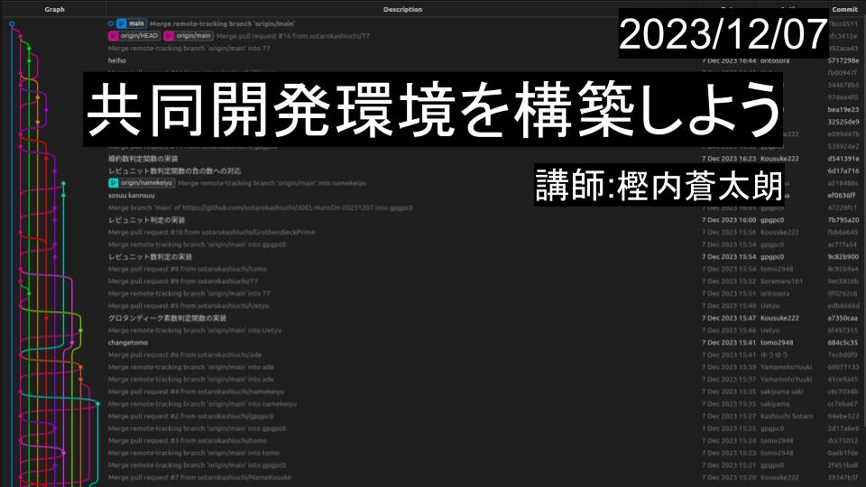
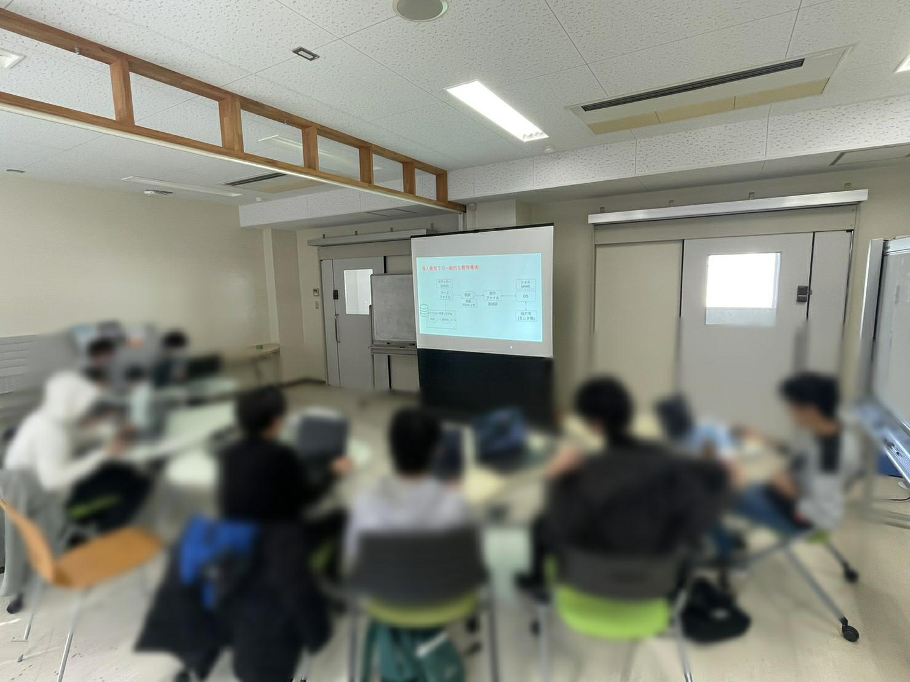
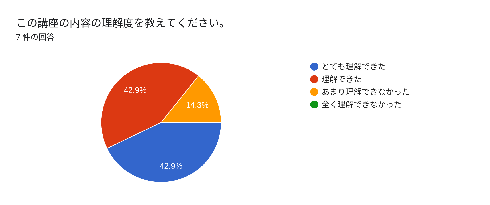
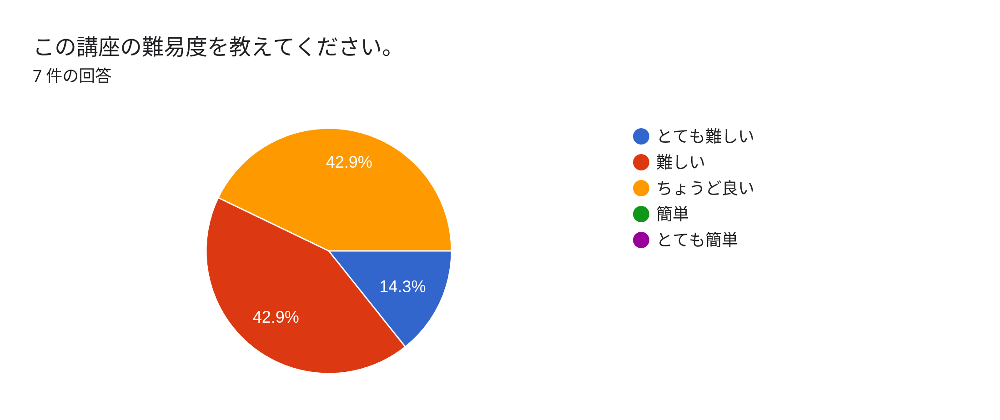
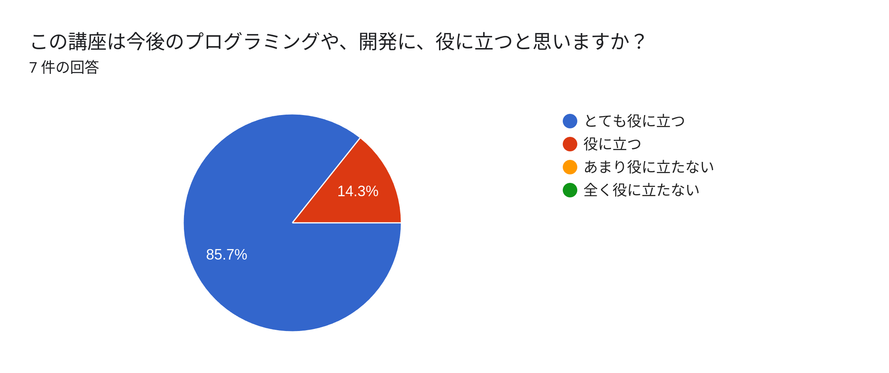
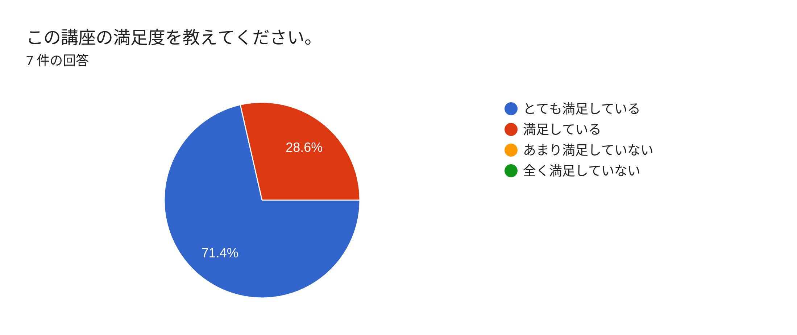

+++
title = "第一回ゆめくじら勉強会"
date = 2023-12-07T23:20:00+09:00
tags = ['勉強会']
aliases = ["/2023/12/JDEL-class/"]
+++

## 第一回ゆめくじら勉強会
第一回ゆめくじらの勉強会を行いました。ゆめくじらのメンバである私が講師を努め、ゆめくじらのメンバ、コンピュータ部の方、知人の計8人が参加してくれました。この講座は[2023/09/16リハーサル](/blog.jp/2023-09-16-JDEL-rehearsal.md)でリハーサルを行った講座です。エディタや、言語プロセッサ、Git、GitHubの使い方などを説明しました。  
講義の資料は[GitHub](https://github.com/sotarokashiuchi/JointDevelopmentEnviromentLesson)にあります。

受講者はとても熱心に聞いてくれ、良かったです。途中クローンできないというトラブルが発生しましたが、なんとか最後まで講義を終えることができました。下の写真は講義の様子と、講義中に使用したハンズオンのGitのグラフです。

## 受講者のアンケート結果
アンケートを実施しました。結果は以下のとおりです。満足度が高かったのは良かったです。しかし理解度がやや低いのと、講義の難易度が高いと答えた学生が多く改善の余地があると思いました。アンケートありがとうございました。

## 改善点
- 休憩を入れる(4時間ぶっ通し×2はまずかった)
- CUIを中心ではなく、Git ClientのGUIを中心に説明するのもあり
- ハンズオンの内容がやや難しいので、少し簡単な課題も用意する
- ハンズオンで実装してもらう関数が誰に割り当てられているのかわからない

などなどが考えられました。Git Clientにはたくさん種類があり、どれを使うと普遍的に開発ができるか考える必要があると思いました。

## 改善
- VSCodeのGit Graphを使用したGit,GitHubの講座を追加した。
    - 初心者向けのシンプルなUI
    - Linux, Max, Windowsの全てのプラットフォームで動作する
    - 有名で、既存の知見がたくさんある
- Issuesを作成し、実装してもらう関数をアサインすることにしました。
    - Template Repogitoryで作ったリポジトリには自動で、実装が必要なIssuesが作成されるように変更した。
- 文字のサイズを大きくしました。

## 今後
実は今回この講座を行った目的は、学生が共同開発環境を構築できるようになってほしいという思いと、来年の春頃にもっと大規模に講座を開催する予定なので、その時の講師やアシスタントとして協力してほしいという思いがありました。なので今後としては、来年の春に行う予定の大規模な講座に向けた準備を進めていきたいと思います。  
またこの講座以外にも、以下のような勉強会を開いてほしいと意見かあったので、今後開催していければと思います。講師は私以外にもでてきてくれるとより面白くなると思います。  
- OSの作り方
- Ghidra等のリバースエンジニアリングツール
- 低レイヤー概論と面白さ
- chatgptの活用方法
- AI（GitHubCopilot、chatGPT）などを使用したプログラミング手法

