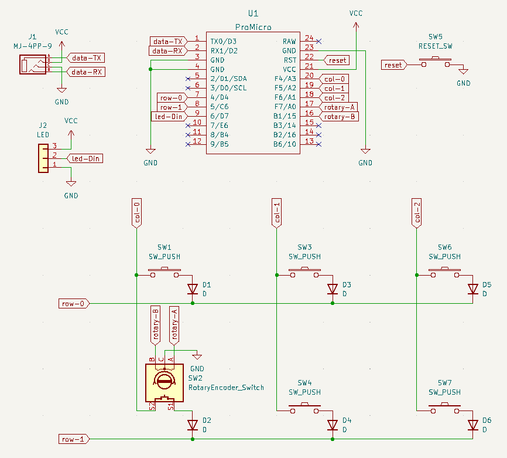
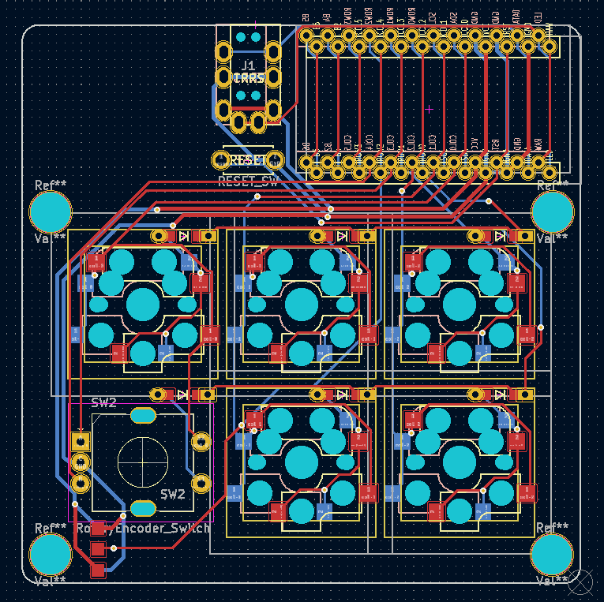
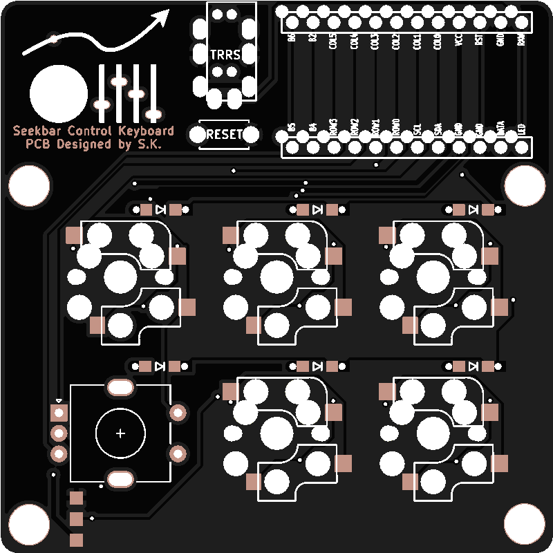

+++
title = "2023/12/17 日記"
date = 2023-12-17T16:23:00+09:00
tags = ['日記']
+++

## 自作キーボード
私はずっとずっとずーと自作キーボードを作りたいと思っていました。その理由は、HHKBのサイトの動画の中で、「パソコンは今や消耗品だが、キーボードは一生もの」というような言葉を聞いたからです。私はこの言葉に非常に納得していました。しかしHHKBのキーボードでは望むようなキーの配列ではなく、また分割キーボードではありません。私は分割型で、親指で操作できるキーが多いキーボードがほしいです。そこで自作しようと随分と前から思っていました。

今回中間テスト期間が終わり、一段落したため、「自作キーボード設計入門 foostan著」という本を購入し、勉強することにしました。この本は非常に実践的で、非常に面白かったです。実際に本に記載されている、基盤をKiCadを使用し真似してみました。ある程度満足したものが作れました。

次に自分が求めているオリジナルのキーボードを設計しようか迷いましたが、その前段階として、小規模なキーボードを作成することにしました。小規模なキーボードだからといて、実用的で無いものを作成してもモチベーションがわかないので、Youtubeや、音楽などで次にスキップや、早送り、一時停止、音量の調節など「シークバー」を操作するためのキーボードを作成することにしました。このキーボードの名前を「Seekbar Control Keyboard」としました。

Seekbar Control Keyboardでは、キースイッチだけではなく、音量調節のためのロータリーエンコーダーも付けました。ロータリーエンコーダはスイッチも付いているものにしました。以下が回路図です。

回路図からプリント基板の設計図を作成していきました。フットプリントを配置したい場所に置くのが難しく苦労しました。配線も苦労したのですが、本を真似した回路よりもだいぶきれいに配線できたため満足です。(素人なのでこれがきれいか汚いかはよくわかりません（笑）)とりあえず横方向の配線を表面、縦方向の配線を裏面にするという自分なりのルールを設け設計しました。

PCBの設計ができ、JLCPCBという会社に基盤の発注を行いました。人生初の基盤発注、難しいのかと思っていましたが、KiCadから出力したファイルを圧縮し、アップロードするだけでした。なんと簡単なのだ！下が発注した基盤です。ちなみに基盤の左上にあるロゴが一番こだわっています（笑）また、やや円安がマシになっていたということもあり、5枚、送料込みで442円！！安い！

基盤を発注している間、ボトムプレートと、トッププレートを設計しました。また必要な部品をカートに入れました。準備は順調に進んでいます！今後が楽しみです！

## GitHub Organizations
今までは個人でGitHubを利用してきたのですが、コンピュータ部内でGitHubを使いたいなと思い、GitHub Organizationsの使い方や設定方法について勉強しました。無料プランで個人アカウントのFreeとほぼ同じ機能が備えられているので十分です。

コンピュータ部でどのようにGitHubを使用するかと言うと、主にWikiやドキュメントの保管場所として使用する予定です。Markdown言語で記述するとGitHubではそれをHTML形式に変換し表示してくれるので便利です。しかしwikiやドキュメントでは会議中に共同編集したい時が出てくると思います。そんな時GitHubでは対応しきれません。そこでVSCodeのLive Shareという機能を使用し、共同編集を可能にしようと考えました。この組み合わせ案外よいのではないかと考えています。(高専のアカウントではNotionなどのWikiツールの学割は適応できないのでGitHubの無料枠を有効活用できていることは大きい)

## アート・オブ・コミュニティ
アート・オブ・コミュニティと言う本を読み始めました。コミュニティーのメンバが自発的に行動し続けるためにはどのようにコミュニティーを形成する必要があるのかというのが書かれています。サークルや部活のために、少しでも良い情報があればと勉強中です。  
サークル内では、まずはミッションが正しく定められていないので、そこから整備していく予定ですっ。

## その他
書きたい内容は沢山あるのですが、眠たく、書くのはしんどいという状態なので、今日は寝ます。今週もよく頑張った！(っあ。明日英語の小テストだ... っあ。明日数学の課題提出日だ... ... ...)

