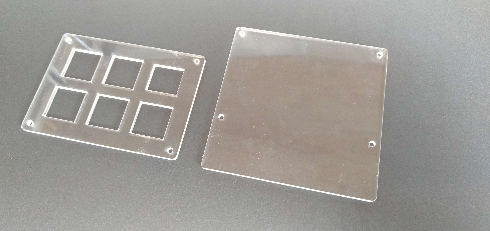
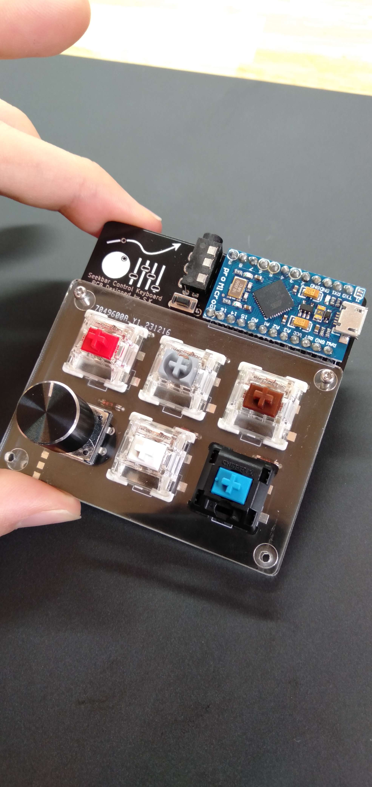
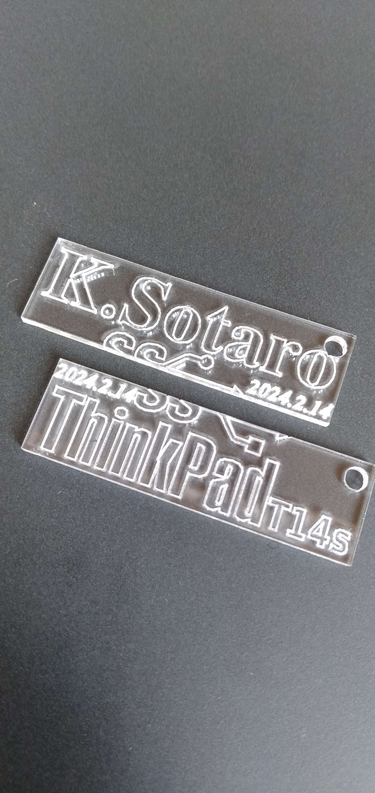

+++
title = "2024/02/18 日記"
date = 2024-02-18T16:20:00+09:00
tags = ['日記']
+++

## 期末テスト
2月7日から2月13日まで期末テストがありました。  
今回一番注意すべき科目は電気回路です。前回のテストも非常に難しかったので、今回はより一層力を入れて勉強を行いました。二週間前からテスト範囲は言われており、そのテスト範囲の演習問題が非常に難しく、焦って多くの時間を費やしました。しかし何と担当の先生がテスト3日前に範囲を大幅に狭めることを発表しました。先生も解いた所、意外と難しかったらしく、2年生にこの問題を解いてもらうのは流石に苦すぎるということで、範囲が狭まりました。直前に範囲を変更されると、勉強をしていた人にとってはとてももったいないので、やめてほしいです。  
実際にテストを受けるとそこまで難しくなく、なんとかなるなあとい感じです。

## 自作キーボード
期末テストも終わり、自作キーボードの作成の続きを再開しました。前回はキーボードのケースをPPという素材を使いレーザー加工したのですが、PPはレーザー加工との相性が悪く、加工した断面が溶けたような感じになりました。

そこで今回はコメリでアクリル板を発注しました。アクリルで加工を行うと非常にきれいに加工できました。下の写真が加工後の写真です。誤差もほとんどなく、キーボードに取り付けてもジャストフィットしました。

ケース作りで余ったアクリルを用いて、キーホルダーも作ってみました。僕が使っているパソコンの名前と、私の名前を入れました。2つのキーホルダーをつなげると、USBの規格のマークが出てくるような設計にしました。結構気に入っています。後は紐をつけて完成です。(紐はなかったのですが..

ひとまず自作キーボードづくりは一区切りがついたので、作ったキーボードのフィードバックを行いました。いろいろな問題点を列挙し、今後の開発につなげたいです。

## 寮生会
今年度最後の寮生会がありました。  
予算の制度や、使い方についていろいろと議論しました。結構白熱しており、正直疲れました。  
議論の中に、その人を否定するような発言を先生がしており、それはよくないなあと思いました。いくら腹がたったとしても、場を考えて発言するべきだと思いました。例えば「普通の人間が考えたらわかるでしょ。」であったりと...
結構白熱した会議も終わり、最後は丸く収まりました。

寮生会終わり、先輩と一緒に寮食を食べました。先輩ともようやく打ち解けて来たところだったので、もう寮生会も終わってしまうのかと正直悲しいです。先輩のみなさまお疲れ様でした。

