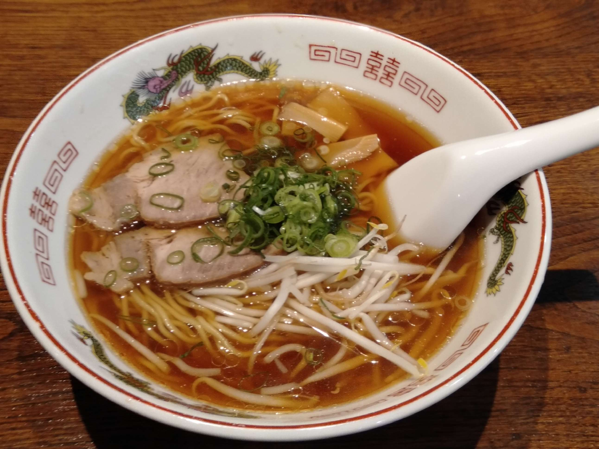
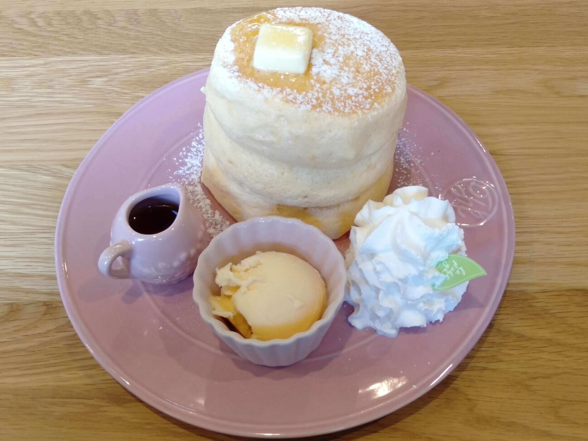
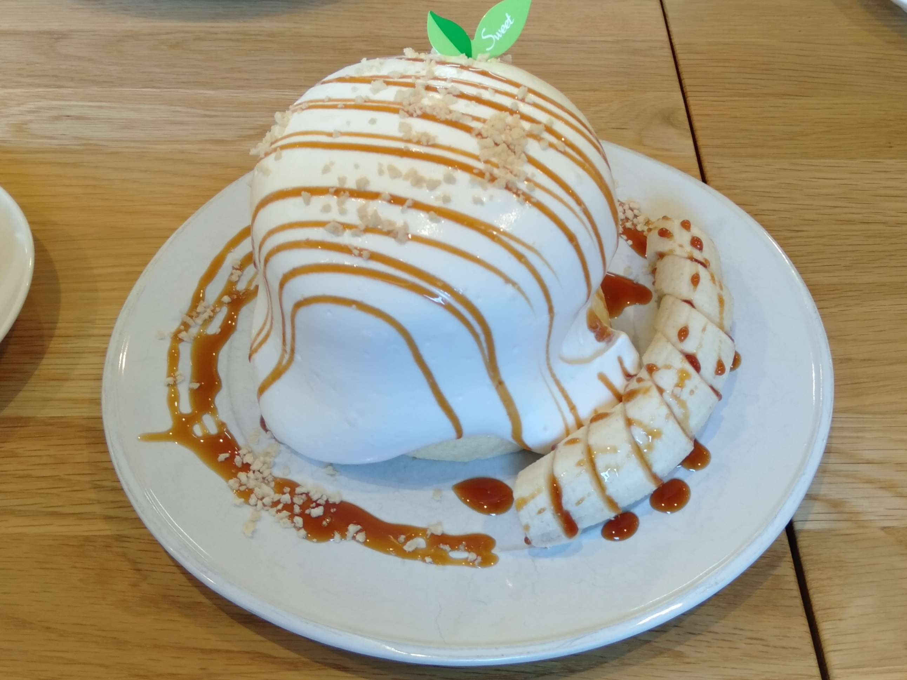

+++
title = "2024/03/09 日記"
date = 2024-03-09T23:00:00+09:00
tags = ['日記']
+++

## 春休み
2月23日から春休みに入りました。寮生活をしているとなかなか髪が切れないので、まずは髪を切りました。そして初めて家で髪を染めてみました。600円でヘアカラーを買い、使ったのは3分の1で、実質200円ほどしかかからず色を染めることができました。仕上がりに関してはよくわかりません（笑）

最近は非常に食べることが喜びとなってきました。最近食べたものです。

特にパンケーキが美味しかったです！  
初めて分厚くてフワフワのパンケーキを食べました。  
大分前に流行っていたみたいで、一度食べたいと願っていたので、非常に嬉しかったです！

パンケーキも美味しかったのですが、それ以上にパンケーキ屋さんの熱意が素敵でした。一つは注文してから分量を測り、材料を混ぜ、焼き上げてくれる点です。注文から少し時間がかかりますが、お客さんに出来たてで、おいしいものを食べてほしいというのが伝わってきました。もう一つは利益を優先せず、お客さんの笑顔を重視している点です。

## 自作キーボード
自作キーボードでは、Seekbar Control Keyboardが完成し、フィードバックも修正しました。  
リポジトリも一般公開しました。ぜひ見てみてください。(>>>[リポジトリ](https://github.com/sotarokashiuchi/SeekbarControlKeyboard))

Seekbar Control Keyboardが完成したので、次はついに自分の普段使うようのキーボードを作り出したいと思っています。

## トップガン
トップガン演習とは、警察庁サイバー警察局情報技術解析課員の方から、サイバー犯罪に対して最前線で対応されている方々の視点で、不正プログラム解析の講習をハンズオン重視の形式で実施いただく講義のことをいいます。このトップガン演習の講義を3月8日に受けてきました。

内容としては、リバースエンジニアリングの手法を解説するというものでした。特に32BitのWindows上で動くアプリのリバースエンジニアリングについてです。既に知っていることもありましたが、頭の中を整理することができ、良かったです。さらに発展的なリバースエンジニアリングの手法と、マルウェアの解析を学べれたら面白いなと思いました。

## Webサイト構築計画
コンピュータ部のプロジェクトの一つで、ありがたいことにプロジェクトリーダーとして任されているプロジェクトに、Webサイト構築計画というものがあります。このプロジェクトは、簡単に言うとコンピュータ部のWebサイトを作ろうというものです。コンピュータ部員のWebサイトに関する技術力の向上も目指しています。

Webサイトを作るにあたり、初めは講義形式でWebサイトの仕組みを教え、後半は自分で自分のWebサイトを構築してみて、最終的にコンピュータ部のWebサイトを開発、保守、運用していこうという方針になりました。現在は第一ステップの講義形式で、Webサイトの仕組みを教える部分です。教えると言っても、私が知っていることを話すだけなので、内容が薄いかもしれませんが、ご了承を.. 今の所、ハンズオン形式で週に2回オンライで集まり、進めています。プロジェクトに参加しているメンバは一年生が多いのですが、毎回MTGに集まり、すごくしっかりと聞いてくれて、教えるのが楽しいです。オンラインなので、なかなか声を出して質問したり、意見を言ったりすることにハードルがあるかもしれませんが、徐々にでも話しやすい空間にしていきたいと考えています！

良いWebサイトができるように、メンバのみんなで協力しいきたいと思います！がんばります！！！
