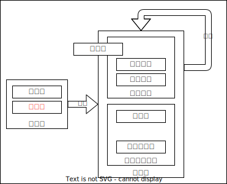
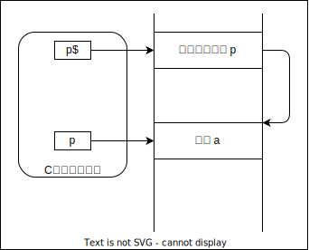
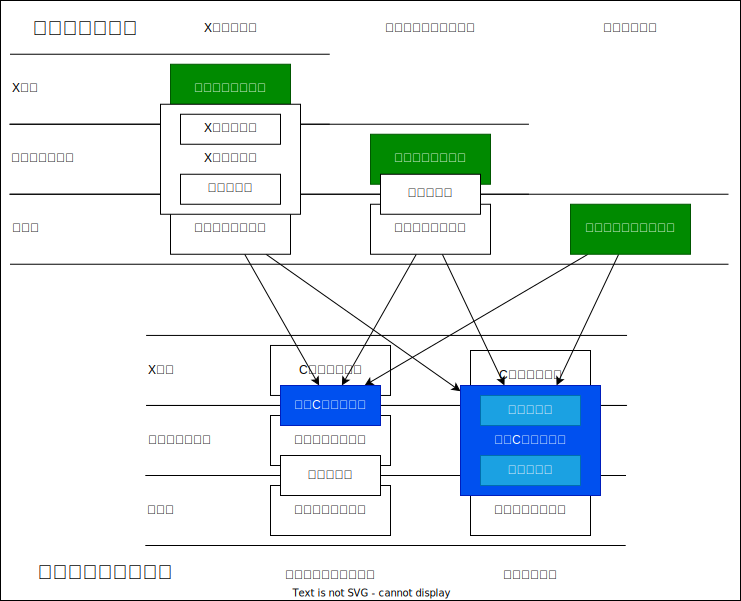

+++
title = "セキュリティ・キャンプ全国大会2023 応募課題公開"
date = 2024-04-01T23:00:00+09:00
tags = ['体験記']
ShowToc = true
TocOpen = false
+++

## 概要
「セキュリティ・キャンプ全国大会2023」のL3『Cコンパイラゼミ』の応募課題を公開します。  
間違っている内容もあると思いますが、ご了承を。

## 問1:コンパイラの動作
コンパイラを一つ選び、そのコンパイラがどのような過程でソースコードから実行バイナリを生成しているかを、現在知っている範囲で説明し、実際にコンパイラがその過程を経ているということを自分なりに検証してみてください。どのように検証したか、そして、その検証結果から何が言えるかを教えて下さい。どの言語をコンパイルするコンパイラかは、好きなものでかまいません。

### 検証環境
今回選んだコンパイラはC言語をコンパイルする「gcc」コンパイラです。検証環境は、Linuxコマンドを使用できる点と、Linuxで使われることが多いABIを使用したかったため、Linuxで行います。具体的にはホストOSで仮想化ソフトを起動し、ゲストOSを立て、ゲストOSで「gcc」コンパイラを動かします。以後の検証を行う環境は基本的に下のとおりです。
- HostOS:										Microsoft Windows 11 Home
- VirtualizatioSoftware:		VMWare Workstation 17 Player
- GuestOS:									Kali GNU/Linux Rolling (2022.2)
- Architecture:							x86_64
- CPU op-mode(s):						32-bit, 64-bit
- Byte Order:								Little Endian
- compiler:									gcc (Debian 11.3.0-3) 11.3.0

### 全体像
まず初めにソースコードから実行可能ファイルが作成されるまでの大まかな過程を知っている範囲でまとめてみます。

ソースコード  
|--プリプロセス(プリプロセッサ)  
プリプロセス後ソースコード(中間コード)  
|--コンパイル(コンパイラ)  
オブジェクトファイル(中間コード)  
|--リンク(リンカ)  
実行可能ファイル  


#### 検証方法
上記の過程が本当に正しいのかどうかをgccコンパイラのオプションを利用して、調べてみます。
1. 簡単なプログラムを作成
2. 中間ファイルを取り出す  
  ```-save-temps```オプションを付けてコンパイルすると、コンパイラが生成した中間ファイルを削除しないようにしてくれるらしい。この機能を利用し、中間ファイルを取り出す。
1. 取り出した中間ファイルを調べる  
  lsコマンドを使って、中間ファイルが作成された順番を調べる  
	fileコマンドを使って中間ファイルを調べる  
  ファイルの中身を見て調べる

今回使用するプログラム
```c
#include <stdio.h>
#define MAX_VALUE 20

int main(void){
	int i, a, b;

	for(i=0; i<MAX_VALUE; i++){
		// MAX_VALUE回挨拶を行う
		printf("%d Hello World\n", i);
	}
	return 0;
}
```

#### 検証結果
```sh
# gccコマンドの実行
└─$ gcc -save-temps main.c 

# 作成日時が古い順から表示
└─$ ls -ltr
total 48
-rw-r--r-- 1 kali kali    76 Apr 24 20:17 main.c
-rw-r--r-- 1 kali kali 17958 Apr 24 20:53 a-main.i
-rw-r--r-- 1 kali kali   465 Apr 24 20:53 a-main.s
-rw-r--r-- 1 kali kali  1368 Apr 24 20:53 a-main.o
-rwxr-xr-x 1 kali kali 15976 Apr 24 20:53 a.out

# fileコマンドを実行し、それぞれのファイルを調べる
└─$ file *
main.c:   C source, ASCII text
a-main.i: C source, ASCII text
a-main.s: assembler source, ASCII text
a-main.o: ELF 64-bit LSB relocatable, x86-64, version 1 (SYSV), not stripped
a.out:    ELF 64-bit LSB pie executable, x86-64, version 1 (SYSV), dynamically linked, interpreter /lib64/ld-linux-x86-64.so.2, BuildID[sha1]=14a8fbe181354a90f63ee35839a3ae1876077f0c, for GNU/Linux 3.2.0, not stripped
```


生成された中間ファイル(a-main.i)
```c
# 0 "main.c"
# 0 "<built-in>"
# 0 "<command-line>"
# 1 "/usr/include/stdc-predef.h" 1 3 4
# 0 "<command-line>" 2
# 1 "main.c"

******** 省略 ********

extern int printf (const char *__restrict __format, ...);

extern int sprintf (char *__restrict __s,
      const char *__restrict __format, ...) __attribute__ ((__nothrow__));

# 2 "main.c" 2

******** 省略 ********

# 4 "main.c"
int main(void){
  int i, a, b;

  for(i=0; i<20; i++){

    printf("%d Hello World\n", i);
  }
  return 0;
}
```

生成された中間ファイル(a-main.s)
```s
	.file	"main.c"
	.text
	.section	.rodata
.LC0:
	.string	"%d Hello World\n"
	.text
	.globl	main
	.type	main, @function
main:
.LFB0:
	.cfi_startproc
	pushq	%rbp
	.cfi_def_cfa_offset 16
	.cfi_offset 6, -16
	movq	%rsp, %rbp
	.cfi_def_cfa_register 6
	subq	$16, %rsp
	movl	$0, -4(%rbp)
	jmp	.L2
.L3:
	movl	-4(%rbp), %eax
	movl	%eax, %esi
	leaq	.LC0(%rip), %rax
	movq	%rax, %rdi
	movl	$0, %eax
	call	printf@PLT
	addl	$1, -4(%rbp)
.L2:
	cmpl	$19, -4(%rbp)
	jle	.L3
	movl	$0, %eax
	leave
	.cfi_def_cfa 7, 8
	ret
	.cfi_endproc
.LFE0:
	.size	main, .-main
	.ident	"GCC: (Debian 11.3.0-3) 11.3.0"
	.section	.note.GNU-stack,"",@progbits
```

#### 検証考察
検証結果より、中間ファイルが作成された時間と中間ファイルの種類から、下記のような処理が行われていると推測できました。プリプロセス後ソースコードをいきなりオブジェクトファイルに変換するという予想と違い、一度アセンブラ言語のコードに変換し、それをアセンブリしていることが分かりました。

main.c    :ソースコード  
  |--プリプロセス(プリプロセッサ)  
a-main.i  :プリプロセス後ソースコード  
  |--コンパイル(コンパイラ)  
a-main.s  :アセンブリ  
  |--アセンブル(アセンブラ)  
a-main.o  :オブジェクトファイル  
  |--リンク(リンカ)  
a.out     :実行可能ファイル 

ここで「コンパイル」という処理が出てきていますが、広義のコンパイラの役割をCソースコードから実行可能ファイルを作成するところまで、狭義のコンパイラの役割をプリプロセス後ソースコードをアセンブリファイルに変換することを指しています。またプリプロセス後ソースコードを読み、分かったことをまとめました。
- ソースコードをプリプロセッサで変換した中間ファイル
- ソースコードのうち「#」がついた前処理命令を処理する
  - #includeで参照しているヘッダファイルが展開されていた
  - #defineで定義されているマクロも展開されていた
- 処理に直接関係のないコメントが削除されていた
- インクルードファイルにも、元々のソースコードにも記載されていない内容が追加されている箇所が何か所もあった
  - ```# 909 "/usr/include/stdio.h" 3 4```などが一例

### プリプロセッサの動作
前回の検証で、プリプロセッサ後ソースコードには、Cソースコードにも記載されていない「```# 909 "/usr/include/stdio.h" 3 4```」というような形式で追加されている箇所が何か所もありました。調べてみると、これらは狭義のコンパイラがエラーメッセージを出力するために使用されるそうです。狭義のコンパイラは、#include文や、#define文、コメント行が削除されたプリプロセス後ソースコードを基にコンパイルします。このままでは、狭義のコンパイラが元々のCソースコードの行番号などを知りません。そこでプリプロセス済みソースコードからでも元々のソースコードの行番号が分かるようにプリプロセッサはファイル情報、行番号情報などを付け加えるそうです。追加される情報の書式としては```#line n [FileName]```で、nには行番号を,FileNmaeにはファイル名が記載されるそうです。

#### 検証方法
1. 文法的に誤りがあるプログラムを作成
2. プリプロセス済みソースコードを取得   
  ```-E```オプションはソースコードからプリプロセス済みソースコードを生成させるオプションである。この機能を使いプリプロセス済みソースコードを取得する
1. プリプロセス済みソースコードの編集  
  取得したプリプロセス済みコードを複製し、2つ用意する。1つは何も変更を加えない。このファイルを「プリプロセス済みソースコードA」とする。もう一つのプリプロセス済みコードは```#line n FineName```のnの行番号を100に変更する。このファイルを「プリプロセス済みソースコードB」とする。
1. 各プリプロセス済みソースコードをコンパイル  
  gccではプリプロセス済みソースコードのファイルを指定してコマンドを実行すると、プリプロセッサ済みソースコードから実行可能ファイルを生成してくれる。プリプロセス済みソースコードA,Bともにこの機能を利用し、広義のコンパイルの続きを行う。プリプロセス済みソースコードA,Bのどちらのファイルも文法的に間違いがあるプログラムのため、エラーメッセージが出力される。そのエラー文を取得し比較する。

今回使用するプログラム
```c
#include <stdio.h>

int main(void){
  // Hello 表示
  printf("Hello\n")
  return 0;
}
```

#### 検証結果
```sh
# ソースコードをプリプロセスする
└─$ gcc -E main.c -o preprosess.i

# プリプロセスファイルを複製
└─$ cp preprosess.i preprosess_A.i
└─$ cp preprosess.i preprosess_B.i

# プリプロセス済みソースコードA
└─$ cat preprosess_A.i
// 省略

# 3 "main.c"
int main(void){

  printf("Hello\n")

  return 0;
}

# プリプロセス済みソースコードB
└─$ cat preprosess_B.i
// 省略

# 100 "main.c"
int main(void){

  printf("Hello\n")

  return 0;
}

# プリプロセス済みソースコードAをコンパイル
└─$ gcc preprosess_A.i 
main.c: In function ‘main’:
main.c:5:20: error: expected ‘;’ before ‘return’
  5 |   printf("Hello\n")
    |                    ^
    |                    ;
  6 | 
  7 |   return 0;
    |   ~~~~~~

# プリプロセス済みソースコードBをコンパイル
└─$ gcc preprosess_B.i           
main.c: In function ‘main’:
main.c:102:20: error: expected ‘;’ before ‘return’
```

#### 検証考察
プリプロセス済みソースコードA, Bの2種類のファイルで、ファイルごとに異なる行番号にエラーがあるとエラーメッセージを出力しました。このことからプリプロセッサが挿入した```#line```の情報を使用し、エラーを出力していることが分かりました。
ここでプリプロセッサの役割をまとめると、狭義のコンパイラがソースコードを読むための準備を行っていました。具体的には、前処理命令、コメント行の削除、エラーメッセージ用の情報の追加等を行っていました。

### 狭義のコンパイラの動作
狭義のコンパイラは、プリプロセス済みソースコードをアセンブラ言語のコードに変換します。バイナリレベルのオブジェクトファイルから関数を呼び出したり、システムコールを呼び出したりすることがあります。その時に、呼び出す方法などのルールが決まっていれば、他のコンパイラがコンパイルしたオブジェクトファイルをそのまま変更せずに使うことができます。このルールがABI(Application Binary Interface)と呼ばれる規約だそうです。x86-64で有名なABIには2つあるそうです。Linuxで標準の「System V AMD64 ABI」、Windowsで標準の「Microsoft x64 ABI」。今回使用している検証環境では「System V AMD64 ABI」が使われています。ABI規約には「プログラムの呼び出し規約」「データ型のサイズやレイアウト」「システムコールの呼び出し規約」「割り込みハンドラの呼び出し規約」などが決められています。具体例として下記に「プログラムの呼び出し規約」をまとめてみました。

#### 「System V AMD64 ABI」の呼び出し規約(Calling Convention)
- 呼び出し規約とは、関数を呼び出す際の決まり事のことです。引数や戻り値をどのように渡すかなどを決めています。
- 整数の関数の引数はRDI,RSI,RDX,RCX,R8,R9レジスタを使って呼び出された関数に渡されます。
- 整数の戻り値には、RAXレジスタを使って呼び出し側の関数に渡されます。
- 関数が呼び出される前と後で、同じ値を保つことが保証されるレジスタもあり、それらのレジスタは呼び出された関数側で一度退避し、RET命令で呼び出し側に戻る時に退避した値を基に戻す必要があります。RSP,RBP,RBX,R12からR15の合計7つのレジスタが対象です。

ここでは整数型の引数や戻り値しか説明をしていませんが、浮動小数点型なども呼び出し規約に含まれています。詳細は次のリンクにかかれています。[ABIドキュメント](https://refspecs.linuxbase.org/elf/x86_64-abi-0.99.pdf)

#### 検証方法
この検証では、本当にABI規約に沿ってアセンブリコードが出力されているかを確認します。
1. ABIの呼び出し規約を検証するためのプログラムを作成する
2. プログラムをオプションを付けてコンパイルする  
  使用するオプションは「```-fno-asynchronous-unwind-tables -masm=intel -save-temps main.c```」です。  
  ```-fno-asynchronous-unwind-tables```はデバッグ用に追加される余分な部分を削除する  
  ```masm=intel```は生成される中間コードのアセンブリ言語のコードをintel記法で出力するように指示する(個人的にintel記法の方が好きだから)  
  ```save-temps```全ての中間ファイルを出力
1. 出力された中間ファイルからアセンブリ言語で書かれたファイルをABI規則に従っているかを調べる

今回使用するプログラム
```c
#include <stdio.h>

int funx1(int arg1, int arg2, int arg3, int arg4, int arg5, int arg6, int arg7, int arg8, int arg9, int arg10){
  return arg1+arg2+arg3+arg4+arg5+arg6+arg7+arg8+arg9+arg10;
}

char funx2(char arg1, char arg2, char arg3, char arg4, char arg5, char arg6, char arg7, char arg8, char arg9, char arg10){
  return arg1+arg2+arg3+arg4+arg5+arg6+arg7+arg8+arg9+arg10;
}

float funx3(float arg1, float arg2, float arg3, float arg4, float arg5, float arg6, float arg7, float arg8, float arg9, float arg10){
  return arg1+arg2+arg3+arg4+arg5+arg6+arg7+arg8+arg9+arg10;
}

double funx4(double arg1, double arg2, double arg3, double arg4, double arg5, double arg6, double arg7, double arg8, double arg9, double arg10){
  return arg1+arg2+arg3+arg4+arg5+arg6+arg7+arg8+arg9+arg10;
}

int* funx5(int* arg1, int* arg2, int* arg3, int* arg4, int* arg5, int* arg6, int* arg7, int* arg8, int* arg9, int* arg10){
  *arg1 = *arg1+*arg2+*arg3+*arg4+*arg5+*arg6+*arg7+*arg8+*arg9+*arg10;
  return arg1;
}


int main(void){


  int arg[10] = {1, 2, 3, 4, 5, 6, 7, 8, 9, 10};
  int ret_int;
  char ret_char;
  float ret_float;
  double ret_double;
  int *ret_int_p;
  
  ret_int = funx1(1, 2, 3, 4, 5, 6, 7, 8, 9 ,10);
  printf("%d\n", ret_int);
  ret_char = funx2(1, 2, 3, 4, 5, 6, 7, 8, 9 ,10);
  printf("%c\n", ret_char);
  ret_float = funx3(1, 2, 3, 4, 5, 6, 7, 8, 9 ,10);
  printf("%f\n", ret_float);
  ret_double = funx4(1, 2, 3, 4, 5, 6, 7, 8, 9 ,10);
  printf("%f\n", ret_double);
  ret_int_p = funx5(&arg[0], &arg[1], &arg[2], &arg[3], &arg[4], &arg[5], &arg[6], &arg[7], &arg[8], &arg[9]);
  printf("%p\n", ret_int_p);

  return 0;
}
```

#### 検証結果
```s
	.file	"main.c"
	.intel_syntax noprefix
	.text
	.globl	funx1
	.type	funx1, @function
funx1:
	push	rbp
	mov	rbp, rsp
	mov	DWORD PTR -4[rbp], edi
	mov	DWORD PTR -8[rbp], esi
	mov	DWORD PTR -12[rbp], edx
	mov	DWORD PTR -16[rbp], ecx
	mov	DWORD PTR -20[rbp], r8d
	mov	DWORD PTR -24[rbp], r9d
	mov	edx, DWORD PTR -4[rbp]
	mov	eax, DWORD PTR -8[rbp]
	add	edx, eax
	mov	eax, DWORD PTR -12[rbp]
	add	edx, eax
	mov	eax, DWORD PTR -16[rbp]
	add	edx, eax
	mov	eax, DWORD PTR -20[rbp]
	add	edx, eax
	mov	eax, DWORD PTR -24[rbp]
	add	edx, eax
	mov	eax, DWORD PTR 16[rbp]
	add	edx, eax
	mov	eax, DWORD PTR 24[rbp]
	add	edx, eax
	mov	eax, DWORD PTR 32[rbp]
	add	edx, eax
	mov	eax, DWORD PTR 40[rbp]
	add	eax, edx
	pop	rbp
	ret
	.size	funx1, .-funx1
	.globl	funx2
	.type	funx2, @function
funx2:
	push	rbp
	mov	rbp, rsp
	push	rbx
	mov	eax, ecx
	mov	ebx, r8d
	mov	r11d, r9d
	mov	r10d, DWORD PTR 16[rbp]
	mov	r9d, DWORD PTR 24[rbp]
	mov	r8d, DWORD PTR 32[rbp]
	mov	ecx, DWORD PTR 40[rbp]
	mov	BYTE PTR -12[rbp], dil
	mov	BYTE PTR -16[rbp], sil
	mov	BYTE PTR -20[rbp], dl
	mov	BYTE PTR -24[rbp], al
	mov	eax, ebx
	mov	BYTE PTR -28[rbp], al
	mov	eax, r11d
	mov	BYTE PTR -32[rbp], al
	mov	eax, r10d
	mov	BYTE PTR -36[rbp], al
	mov	eax, r9d
	mov	BYTE PTR -40[rbp], al
	mov	eax, r8d
	mov	BYTE PTR -44[rbp], al
	mov	eax, ecx
	mov	BYTE PTR -48[rbp], al
	movzx	edx, BYTE PTR -12[rbp]
	movzx	eax, BYTE PTR -16[rbp]
	add	edx, eax
	movzx	eax, BYTE PTR -20[rbp]
	add	edx, eax
	movzx	eax, BYTE PTR -24[rbp]
	add	edx, eax
	movzx	eax, BYTE PTR -28[rbp]
	add	edx, eax
	movzx	eax, BYTE PTR -32[rbp]
	add	edx, eax
	movzx	eax, BYTE PTR -36[rbp]
	add	edx, eax
	movzx	eax, BYTE PTR -40[rbp]
	add	edx, eax
	movzx	eax, BYTE PTR -44[rbp]
	add	edx, eax
	movzx	eax, BYTE PTR -48[rbp]
	add	eax, edx
	mov	rbx, QWORD PTR -8[rbp]
	leave
	ret
	.size	funx2, .-funx2
	.globl	funx3
	.type	funx3, @function
funx3:
	push	rbp
	mov	rbp, rsp
	movss	DWORD PTR -4[rbp], xmm0
	movss	DWORD PTR -8[rbp], xmm1
	movss	DWORD PTR -12[rbp], xmm2
	movss	DWORD PTR -16[rbp], xmm3
	movss	DWORD PTR -20[rbp], xmm4
	movss	DWORD PTR -24[rbp], xmm5
	movss	DWORD PTR -28[rbp], xmm6
	movss	DWORD PTR -32[rbp], xmm7
	movss	xmm0, DWORD PTR -4[rbp]
	addss	xmm0, DWORD PTR -8[rbp]
	addss	xmm0, DWORD PTR -12[rbp]
	addss	xmm0, DWORD PTR -16[rbp]
	addss	xmm0, DWORD PTR -20[rbp]
	addss	xmm0, DWORD PTR -24[rbp]
	addss	xmm0, DWORD PTR -28[rbp]
	addss	xmm0, DWORD PTR -32[rbp]
	addss	xmm0, DWORD PTR 16[rbp]
	addss	xmm0, DWORD PTR 24[rbp]
	pop	rbp
	ret
	.size	funx3, .-funx3
	.globl	funx4
	.type	funx4, @function
funx4:
	push	rbp
	mov	rbp, rsp
	movsd	QWORD PTR -8[rbp], xmm0
	movsd	QWORD PTR -16[rbp], xmm1
	movsd	QWORD PTR -24[rbp], xmm2
	movsd	QWORD PTR -32[rbp], xmm3
	movsd	QWORD PTR -40[rbp], xmm4
	movsd	QWORD PTR -48[rbp], xmm5
	movsd	QWORD PTR -56[rbp], xmm6
	movsd	QWORD PTR -64[rbp], xmm7
	movsd	xmm0, QWORD PTR -8[rbp]
	addsd	xmm0, QWORD PTR -16[rbp]
	addsd	xmm0, QWORD PTR -24[rbp]
	addsd	xmm0, QWORD PTR -32[rbp]
	addsd	xmm0, QWORD PTR -40[rbp]
	addsd	xmm0, QWORD PTR -48[rbp]
	addsd	xmm0, QWORD PTR -56[rbp]
	addsd	xmm0, QWORD PTR -64[rbp]
	addsd	xmm0, QWORD PTR 16[rbp]
	addsd	xmm0, QWORD PTR 24[rbp]
	movq	rax, xmm0
	movq	xmm0, rax
	pop	rbp
	ret
	.size	funx4, .-funx4
	.globl	funx5
	.type	funx5, @function
funx5:
	push	rbp
	mov	rbp, rsp
	mov	QWORD PTR -8[rbp], rdi
	mov	QWORD PTR -16[rbp], rsi
	mov	QWORD PTR -24[rbp], rdx
	mov	QWORD PTR -32[rbp], rcx
	mov	QWORD PTR -40[rbp], r8
	mov	QWORD PTR -48[rbp], r9
	mov	rax, QWORD PTR -8[rbp]
	mov	edx, DWORD PTR [rax]
	mov	rax, QWORD PTR -16[rbp]
	mov	eax, DWORD PTR [rax]
	add	edx, eax
	mov	rax, QWORD PTR -24[rbp]
	mov	eax, DWORD PTR [rax]
	add	edx, eax
	mov	rax, QWORD PTR -32[rbp]
	mov	eax, DWORD PTR [rax]
	add	edx, eax
	mov	rax, QWORD PTR -40[rbp]
	mov	eax, DWORD PTR [rax]
	add	edx, eax
	mov	rax, QWORD PTR -48[rbp]
	mov	eax, DWORD PTR [rax]
	add	edx, eax
	mov	rax, QWORD PTR 16[rbp]
	mov	eax, DWORD PTR [rax]
	add	edx, eax
	mov	rax, QWORD PTR 24[rbp]
	mov	eax, DWORD PTR [rax]
	add	edx, eax
	mov	rax, QWORD PTR 32[rbp]
	mov	eax, DWORD PTR [rax]
	add	edx, eax
	mov	rax, QWORD PTR 40[rbp]
	mov	eax, DWORD PTR [rax]
	add	edx, eax
	mov	rax, QWORD PTR -8[rbp]
	mov	DWORD PTR [rax], edx
	mov	rax, QWORD PTR -8[rbp]
	pop	rbp
	ret
	.size	funx5, .-funx5
	.section	.rodata
.LC0:
	.string	"%d\n"
.LC1:
	.string	"%c\n"
.LC12:
	.string	"%f\n"
.LC23:
	.string	"%p\n"
	.text
	.globl	main
	.type	main, @function
main:
	push	rbp
	mov	rbp, rsp
	sub	rsp, 80

	# 配列の定義
	mov	DWORD PTR -80[rbp], 1
	mov	DWORD PTR -76[rbp], 2
	mov	DWORD PTR -72[rbp], 3
	mov	DWORD PTR -68[rbp], 4
	mov	DWORD PTR -64[rbp], 5
	mov	DWORD PTR -60[rbp], 6
	mov	DWORD PTR -56[rbp], 7
	mov	DWORD PTR -52[rbp], 8
	mov	DWORD PTR -48[rbp], 9
	mov	DWORD PTR -44[rbp], 10

	# funx1呼び出し処理
	# int funx1(int arg1, int arg2, int arg3, int arg4, int arg5, int arg6, int arg7, int arg8, int arg9, int arg10){
	# EAX funx1(EDI, ESI, EDX, ECX, R8D, R9D, push,...)
	# RAX funx1(RDI, RSI, RDX, RCX, R8, R9, push,...)
	push	10
	push	9
	push	8
	push	7
	mov	r9d, 6
	mov	r8d, 5
	mov	ecx, 4
	mov	edx, 3
	mov	esi, 2
	mov	edi, 1
	call	funx1
	add	rsp, 32
	mov	DWORD PTR -4[rbp], eax #funx1の戻り値
	mov	eax, DWORD PTR -4[rbp]
	mov	esi, eax #第二引数
	lea	rax, .LC0[rip]
	mov	rdi, rax #第一引数
	mov	eax, 0
	call	printf@PLT #printf(RDI, RSI, RDX, RCX, R8, R9, push,...)

	# funx2呼び出し処理
	# char funx2(char arg1, char arg2, char arg3, char arg4, char arg5, char arg6, char arg7, char arg8, char arg9, char arg10){
	# AL funx2(EDI, ESI, EDX, ECX, R8D, R9D, push,...)
	# RAX funx2(RDI, RSI, RDX, RCX, R8, R9, push,...)
	push	10
	push	9
	push	8
	push	7
	mov	r9d, 6
	mov	r8d, 5
	mov	ecx, 4
	mov	edx, 3
	mov	esi, 2
	mov	edi, 1
	call	funx2
	add	rsp, 32
	mov	BYTE PTR -5[rbp], al #funx1の戻り値
	movsx	eax, BYTE PTR -5[rbp]
	mov	esi, eax
	lea	rax, .LC1[rip]
	mov	rdi, rax
	mov	eax, 0
	call	printf@PLT

	# funx3呼び出し処理
	# float funx3(float arg1, float arg2, float arg3, float arg4, float arg5, float arg6, float arg7, float arg8, float arg9, float arg10){
	# xmm0 funx3(xmm0, xmm1, xmm2, xmm3, xmm4, xmm5, xmm6, xmm7, スタック, スタック)
	movss	xmm0, DWORD PTR .LC2[rip]		# 10.0
	lea	rsp, -8[rsp]
	movss	DWORD PTR [rsp], xmm0
	movss	xmm0, DWORD PTR .LC3[rip]		# 9.0
	lea	rsp, -8[rsp]
	movss	DWORD PTR [rsp], xmm0
	movss	xmm7, DWORD PTR .LC4[rip]		# 8.0
	movss	xmm6, DWORD PTR .LC5[rip]		# 7.0
	movss	xmm5, DWORD PTR .LC6[rip]		# 6.0
	movss	xmm4, DWORD PTR .LC7[rip]		# 5.0
	movss	xmm3, DWORD PTR .LC8[rip]		# 4.0
	movss	xmm2, DWORD PTR .LC9[rip]		# 3.0
	movss	xmm1, DWORD PTR .LC10[rip]	# 2.0
	mov	eax, DWORD PTR .LC11[rip]
	movd	xmm0, eax
	call	funx3
	add	rsp, 16
	movd	eax, xmm0  #funx1の戻り値
	mov	DWORD PTR -12[rbp], eax
	pxor	xmm1, xmm1
	cvtss2sd	xmm1, DWORD PTR -12[rbp]
	movq	rax, xmm1
	movq	xmm0, rax
	lea	rax, .LC12[rip]
	mov	rdi, rax
	mov	eax, 1
	call	printf@PLT

	# funx4呼び出し処理
	# double funx4(double arg1, double arg2, double arg3, double arg4, double arg5, double arg6, double arg7, double arg8, double arg9, double arg10){
	# xmm0 funx4(xmm0, xmm1, xmm3, xmm4, xmm5, xmm6, xmm7, スタック, スタック)
	movsd	xmm7, QWORD PTR .LC13[rip]	# 8.0
	movsd	xmm6, QWORD PTR .LC14[rip]	# 7.0
	movsd	xmm5, QWORD PTR .LC15[rip]	# 6.0
	movsd	xmm4, QWORD PTR .LC16[rip]	# 5.0
	movsd	xmm3, QWORD PTR .LC17[rip]	# 4.0
	movsd	xmm2, QWORD PTR .LC18[rip]	# 3.0
	movsd	xmm1, QWORD PTR .LC19[rip]	# 2.0
	mov	rax, QWORD PTR .LC20[rip]			# 1.0
	movsd	xmm0, QWORD PTR .LC21[rip]	# 10.0
	lea	rsp, -8[rsp]
	movsd	QWORD PTR [rsp], xmm0
	movsd	xmm0, QWORD PTR .LC22[rip]	# 9.0
	lea	rsp, -8[rsp]
	movsd	QWORD PTR [rsp], xmm0
	movq	xmm0, rax
	call	funx4
	add	rsp, 16
	movq	rax, xmm0  #funx1の戻り値
	mov	QWORD PTR -24[rbp], rax
	mov	rax, QWORD PTR -24[rbp]
	movq	xmm0, rax
	lea	rax, .LC12[rip]
	mov	rdi, rax
	mov	eax, 1
	call	printf@PLT

	# funx5呼び出し処理
	# int* funx5(int* arg1, int* arg2, int* arg3, int* arg4, int* arg5, int* arg6, int* arg7, int* arg8, int* arg9, int* arg10){
	# RAX funx5(RDI, RSI, RDX, RCX, R8, R9, スタック, スタック, スタック, スタック)
	# 第6~1引数
	lea	rax, -80[rbp]
	lea	r9, 20[rax]		# 第6引数
	lea	rax, -80[rbp]
	lea	r8, 16[rax]		# 第5引数
	lea	rax, -80[rbp]
	lea	rcx, 12[rax]	# 第4引数
	lea	rax, -80[rbp]
	lea	rdx, 8[rax]		# 第3引数
	lea	rax, -80[rbp]
	lea	rsi, 4[rax]		# 第2引数
	lea	rax, -80[rbp]
	
	lea	rdi, -80[rbp]
	add	rdi, 36
	push	rdi					# 第10引数
	lea	rdi, -80[rbp]
	add	rdi, 32
	push	rdi					# 第9引数
	lea	rdi, -80[rbp]
	add	rdi, 28
	push	rdi					# 第8引数
	lea	rdi, -80[rbp]
	add	rdi, 24
	push	rdi					# 第7引数
	mov	rdi, rax			# 第1引数
	call	funx5
	add	rsp, 32
	mov	QWORD PTR -32[rbp], rax  #funx1の戻り値
	mov	rax, QWORD PTR -32[rbp]
	mov	rsi, rax
	lea	rax, .LC23[rip]
	mov	rdi, rax
	mov	eax, 0
	call	printf@PLT
	mov	eax, 0
	leave
	ret
	.size	main, .-main
	.section	.rodata
	.align 4
.LC2:
	# 0100 0001 0010 0000 0000 0000 0000 0000
	# 符号部:0, 指数部:1000 0010, 仮数部:010 0000 0000 0000 0000 0000
	# 10進数:10.0
	.long	1092616192
	.align 4
.LC3:
	# 10進数:9.0
	.long	1091567616
	.align 4
.LC4:
	# 10進数:8.0
	.long	1090519040
	.align 4
.LC5:
	# 10進数:7.0
	.long	1088421888
	.align 4
.LC6:
	# 10進数:6.0
	.long	1086324736
	.align 4
.LC7:
	# 10進数:5.0
	.long	1084227584
	.align 4
.LC8:
	# 10進数:4.0
	.long	1082130432
	.align 4
.LC9:
	# 10進数:3.0
	.long	1077936128
	.align 4
.LC10:
	# 10進数:2.0
	.long	1073741824
	.align 4
.LC11:
	# 10進数:1.0
	.long	1065353216
	.align 8
.LC13:
	# 0100 0000 0010 0000 0000 0000 0000 0000
	# 0000 0000 0000 0000 0000 0000 0000 0000
	# 符号部:0, 指数部:100 0000 0010, 仮数部:0000 0000 0000 0000 0000 0000 0000 0000 0000 0000 0000 0000 0000
	# 10進数:8.0
	.long	0
	.long	1075838976
	.align 8
.LC14:
	# 10進数:7.0
	.long	0
	.long	1075576832
	.align 8
.LC15:
	# 10進数:6.0
	.long	0
	.long	1075314688
	.align 8
.LC16:
	# 10進数:5
	.long	0
	.long	1075052544
	.align 8
.LC17:
	# 10進数:4
	.long	0
	.long	1074790400
	.align 8
.LC18:
	# 10進数:3
	.long	0
	.long	1074266112
	.align 8
.LC19:
	# 10進数:2
	.long	0
	.long	1073741824
	.align 8
.LC20:
	# 10進数:1
	.long	0
	.long	1072693248
	.align 8
.LC21:
	# 10進数:10.0
	.long	0
	.long	1076101120
	.align 8
.LC22:
	# 10進数:9.0
	.long	0
	.long	1075970048
	.ident	"GCC: (Debian 11.3.0-3) 11.3.0"
	.section	.note.GNU-stack,"",@progbits

```

まとめるとそれぞれの関数に対して以下のようにレジスタやスタックが利用されていた
```c
int funx1(int, int, int, int, int, int, int, int, int, int);
EAX funx1(EDI, ESI, EDX, ECX, R8D, R9D, スタック, スタック, スタック, スタック)
RAX funx1(RDI, RSI, RDX, RCX, R8, R9, スタック, スタック, スタック, スタック)

char funx2(char, char, char, char, char, char, char, char, char, char);
AL funx2(EDI, ESI, EDX, ECX, R8D, R9D, スタック, スタック, スタック, スタック)
RAX funx2(RDI, RSI, RDX, RCX, R8, R9, スタック, スタック, スタック, スタック)


float funx3(float, float, float, float, float, float, float, float, float, float);
xmm0 funx3(xmm0, xmm1, xmm2, xmm3, xmm4, xmm5, xmm6, xmm7, スタック, スタック)

double funx4(double, double, double, double, double, double, double, double, double, double);
xmm0 funx4(xmm0, xmm1, xmm3, xmm4, xmm5, xmm6, xmm7, スタック, スタック)

int* funx5(int*, int*, int*, int*, int*, int*, int*, int*, int*, int*);
RAX funx5(RDI, RSI, RDX, RCX, R8, R9, スタック, スタック, スタック, スタック)
```

#### 検証考察
C言語のデータ型とメモリ上のサイズをsizeof関数で求めた表を下に示します。
| データ型 | サイズ(byte) |
| -------- | ------------ |
| int      | 4            |
| char     | 1            |
| ポインタ | 8            |
| float    | 4            |
| double   | 8            |

次に検証結果を下の表にまとめました。

| 引数      | 1    | 2    | 3    | 4    | 5    | 6    | 第7引数以降 | 戻り値 |
| --------- | ---- | ---- | ---- | ---- | ---- | ---- | ----------- | ------ |
| グループ1 | RDI  | RSI  | RDX  | RCX  | R8   | R9   | スタック    | RAX    |
| グループ2 | xmm0 | xmm1 | xmm2 | xmm3 | xmm4 | xmm5 | スタック    | xmm0   |

検証結果から2つのパターンに分かれました。

グループ1
- 64bit(8byte)以下の整数とアドレスの場合
- C言語のデータ型としてはint型、char型、ポインタ型が該当した

グループ2
- 浮動小数点数の場合
- C言語のデータ型としてはfloat型、double型が該当した

検証結果から「System V AMD64 ABI」の呼び出し規約が守られるようにC言語のソースコードからアセンブリ言語に変換されていることが分かりました。

### アセンブラの動作
アセンブラはアセンブリコードをオブジェクトファイルに変換します。
オブジェクトファイルとは機械語バイナリと、リンクする際に必要となる情報やコメントなどが含まれるファイルです。gccコンパイラでは「ELF64bit」のファイルフォーマットで出力されました。

#### 検証方法
アセンブラが、アセンブリコードを機械語バイナリに変換できているか検証します。
1. 簡単なプログラムを作成
2. コンパイラに中間コードを出力させる
3. 中間コードのオブジェクトファイルを逆アセンブルする  
	```objdump -D a-main.o -M intel```コマンドで逆アセンブル  
	```-D```全てのセクションを逆アセンブル  
	```-M intel```アセンブルコードをインテル記法で表示  
1. 中間コードのアセンブリコードと逆アセンブル結果を比較する
	
今回使用するプログラム
```c
#include <stdio.h>

int main(void){
  int x = 2;
  printf("x = %d", x);
  return 0;
}
```

#### 検証結果
```sh
# gccコマンドを実行し、中間コードを生成
└─$ gcc -save-temps main.c -masm=intel -fno-asynchronous-unwind-tables

# objdumpコマンドを使用して逆アセンブル
└─$ objdump -D a-main.o -M intel > a-main_disassemble.s
```

中間コードのアセンブリコード a-main.s
```s
	.file	"main.c"
	.intel_syntax noprefix
	.text
	.section	.rodata
.LC0:
	.string	"x = %d"
	.text
	.globl	main
	.type	main, @function
main:
	push	rbp
	mov	rbp, rsp
	sub	rsp, 16
	mov	DWORD PTR -4[rbp], 2
	mov	eax, DWORD PTR -4[rbp]
	mov	esi, eax
	lea	rax, .LC0[rip]
	mov	rdi, rax
	mov	eax, 0
	call	printf@PLT
	mov	eax, 0
	leave
	ret
	.size	main, .-main
	.ident	"GCC: (Debian 11.3.0-3) 11.3.0"
	.section	.note.GNU-stack,"",@progbits
```

中間コードのオブジェクトファイルを逆アセンブルしたファイル a-main_disassemble.s
```s
a-main.o:     file format elf64-x86-64

Disassembly of section .text:

0000000000000000 <main>:
   0:	55                   	push   rbp
   1:	48 89 e5             	mov    rbp,rsp
   4:	48 83 ec 10          	sub    rsp,0x10
   8:	c7 45 fc 02 00 00 00 	mov    DWORD PTR [rbp-0x4],0x2
   f:	8b 45 fc             	mov    eax,DWORD PTR [rbp-0x4]
  12:	89 c6                	mov    esi,eax
  14:	48 8d 05 00 00 00 00 	lea    rax,[rip+0x0]        # 1b <main+0x1b>
  1b:	48 89 c7             	mov    rdi,rax
  1e:	b8 00 00 00 00       	mov    eax,0x0
  23:	e8 00 00 00 00       	call   28 <main+0x28>
  28:	b8 00 00 00 00       	mov    eax,0x0
  2d:	c9                   	leave  
  2e:	c3                   	ret    

# 省略
```

#### 検証考察
中間コードのアセンブリコードと逆アセンブルしたアセンブリコードを比べると、表示のされかた(10進数表示と16進数表示など)が少し違うが、同じ内容のアセンブリコードであることが分かります。逆アセンブルしたファイルには、アセンブリに対応する機械語の命令が左に書かれています。検証結果から、アセンブラは正しくアセンブリコードを機械語バイナリに翻訳できていることが分かりました。

### アセンブラの動作(オブジェクトファイル編)
アセンブラはアセンブリコードをオブジェクトファイルに変換します。ここでは前回に引き続き、オブジェクトファイルについて詳しくみていきます。
オブジェクトファイルはELF形式で出力されていると述べましたが、実はELF形式のファイルには複数の状態(種類)があるそうです。以下に複数の状態(種類)を紹介します。
- 再配置可能ファイル(オブジェクトファイル)
  - 広義のコンパイラに含まれているアセンブラがアセンブリした時に出力するプログラム
  - このファイルは実行することができない
  - リンクすることで実行することができる
- 実行可能ファイル
  - リンカがリンクした後に出力するファイル
  - コマンドラインから実行することができる状態
- 共有オブジェクトファイル
  - 再配置可能ファイルの共有オブジェクト専用

注意すべき点としては、アセンブラが出力するELF形式のファイルは、再配置可能ファイルです。再配置可能ファイルの構造の細かい構造は以下のリンクから確認できます。(https://docs.oracle.com/cd/E19683-01/816-3972/6ma7euq9j/index.htm)

ここでは、主なELFファイルの構造を大まかに説明します。
ELF形式のファイルにはファイルヘッダ、プログラムヘッダ、セクションヘッダ、セクションなどに分かれています。下の写真のように、ファイルヘッダからアドレスを辿ることで、セクションヘッダやプログラムヘッダの位置を知ることができます。またセクションヘッダからセクションの開始位置などを知ることが出来ます。リンク前のオブジェクトファイルではプログラムヘッダは必要ないので、ここでは解説しません。


下の構造体のようにELF形式のファイルのフォーマットが定義されています。
```c
// ファイルヘッダ
#define EI_NIDENT       16
typedef struct {
  unsigned char   e_ident[EI_NIDENT]; 
  Elf64_Half      e_type;     //オブジェクトファイルの種類
  Elf64_Half      e_machine;  //必要なアーキテクチャを指定
  Elf64_Word      e_version;  //オブジェクトファイルのバージョン
  Elf64_Addr      e_entry;    //エントリーポイント
  Elf64_Off       e_phoff;    //プログラムヘッダのオフセット
  Elf64_Off       e_shoff;    //セクションヘッダのオフセット
  Elf64_Word      e_flags;    //プロセッサ固有のフラグ
  Elf64_Half      e_ehsize;   //ファイルヘッダのサイズ
  Elf64_Half      e_phentsize;//プログラムヘッダの1要素のサイズ
  Elf64_Half      e_phnum;    //プログラムヘッダの要素数
  Elf64_Half      e_shentsize;//セクションヘッダの1要素のサイズ
  Elf64_Half      e_shnum;    //セクションヘッダの要素数
  Elf64_Half      e_shstrndx;
} Elf64_Ehdr;

// セクションヘッダ
typedef struct {
  Elf64_Word      sh_name;    //セクション名
  Elf64_Word      sh_type;    //セクションのタイプ
  Elf64_Xword     sh_flags;   //セクションに関するフラグ
  Elf64_Addr      sh_addr;    //
  Elf64_Off       sh_offset;  //セクションの先頭バイトが存在するオフセット
  Elf64_Xword     sh_size;    //セクションのサイズ
  Elf64_Word      sh_link;
  Elf64_Word      sh_info;    //追加情報
  Elf64_Xword     sh_addralign;
  Elf64_Xword     sh_entsize;
} Elf64_Shdr;
```

#### 検証方法
アセンブラが出力したオブジェクトファイルがELF形式の仕様通りになっているか検証します。
1. 簡単なプログラムを作成する
2. コンパイラでオブジェクトファイルを出力させる
3. オブジェクトファイルをバイナリ列で解析する  
  ```hexdump -C FineName```コマンドを使用する  
	```hexdump```コマンドはファイルをバイナリファイルとして扱い、16進数などで表示させる  
	```-C```は16進数とASCII文字で表示  
4. オブジェクトファイルを解析コマンドを使用して解析する  
	```readelf -hlS a-main.o```コマンドを使用して解析する  
	```readelf```コマンドはELFファイルの情報を分析し、表示する  
	```-h```はファイルヘッダの情報を表示させる  
	```-l```はプログラムヘッダの情報を表示させる  
	```-S```はセクションヘッダの情報を表示させる  
5. 解析コマンドとバイナリ列を比較する

今回使用するプログラム
```c
#include <stdio.h>

int main(void){
  int x = 2;
  printf("x = %d", x);
  return 0;
}
```

#### 検証結果
```sh
# コンパイラに中間コードを出力させる
└─$ gcc -save-temps main.c

# オブジェクトファイルをバイナリ列で表示させる
└─$ hexdump -C a-main.o
00000000  7f 45 4c 46 02 01 01 00  00 00 00 00 00 00 00 00  |.ELF............|
00000010  01 00 3e 00 01 00 00 00  00 00 00 00 00 00 00 00  |..>.............|
00000020  00 00 00 00 00 00 00 00  28 02 00 00 00 00 00 00  |........(.......|
00000030  00 00 00 00 40 00 00 00  00 00 40 00 0d 00 0c 00  |....@.....@.....|
00000040 >55 48 89 e5 48 83 ec 10  c7 45 fc 02 00 00 00 8b  |UH..H....E......|
00000050  45 fc 89 c6 48 8d 05 00  00 00 00 48 89 c7 b8 00  |E...H......H....|
00000060  00 00 00 e8 00 00 00 00  b8 00 00 00 00 c9 c3>78  |...............x|
00000070  20 3d 20 25 64>00 00 47  43 43 3a 20 28 44 65 62  | = %d..GCC: (Deb|
00000080  69 61 6e 20 31 31 2e 33  2e 30 2d 33 29 20 31 31  |ian 11.3.0-3) 11|
00000090  2e 33 2e 30>00 00 00 00 >14 00 00 00 00 00 00 00  |.3.0............|
000000a0  01 7a 52 00 01 78 10 01  1b 0c 07 08 90 01 00 00  |.zR..x..........|
000000b0  1c 00 00 00 1c 00 00 00  00 00 00 00 2f 00 00 00  |............/...|
000000c0  00 41 0e 10 86 02 43 0d  06 6a 0c 07 08 00 00 00  |.A....C..j......|
000000d0 >00 00 00 00 00 00 00 00  00 00 00 00 00 00 00 00  |................|
000000e0  00 00 00 00 00 00 00 00  01 00 00 00 04 00 f1 ff  |................|
000000f0  00 00 00 00 00 00 00 00  00 00 00 00 00 00 00 00  |................|
00000100  00 00 00 00 03 00 01 00  00 00 00 00 00 00 00 00  |................|
00000110  00 00 00 00 00 00 00 00  00 00 00 00 03 00 05 00  |................|
00000120  00 00 00 00 00 00 00 00  00 00 00 00 00 00 00 00  |................|
00000130  08 00 00 00 12 00 01 00  00 00 00 00 00 00 00 00  |................|
00000140  2f 00 00 00 00 00 00 00  0d 00 00 00 10 00 00 00  |/...............|
00000150  00 00 00 00 00 00 00 00  00 00 00 00 00 00 00 00  |................|
00000160 >00 6d 61 69 6e 2e 63 00  6d 61 69 6e 00 70 72 69  |.main.c.main.pri|
00000170  6e 74 66 00 00 00 00 00 >17 00 00 00 00 00 00 00  |ntf.............|
00000180  02 00 00 00 03 00 00 00  fc ff ff ff ff ff ff ff  |................|
00000190  24 00 00 00 00 00 00 00  04 00 00 00 05 00 00 00  |$...............|
000001a0  fc ff ff ff ff ff ff ff >20 00 00 00 00 00 00 00  |........ .......|
000001b0  02 00 00 00 02 00 00 00  00 00 00 00 00 00 00 00  |................|
000001c0 >00 2e 73 79 6d 74 61 62  00 2e 73 74 72 74 61 62  |..symtab..strtab|
000001d0  00 2e 73 68 73 74 72 74  61 62 00 2e 72 65 6c 61  |..shstrtab..rela|
000001e0  2e 74 65 78 74 00 2e 64  61 74 61 00 2e 62 73 73  |.text..data..bss|
000001f0  00 2e 72 6f 64 61 74 61  00 2e 63 6f 6d 6d 65 6e  |..rodata..commen|
00000200  74 00 2e 6e 6f 74 65 2e  47 4e 55 2d 73 74 61 63  |t..note.GNU-stac|
00000210  6b 00 2e 72 65 6c 61 2e  65 68 5f 66 72 61 6d 65  |k..rela.eh_frame|
00000220  00 00 00 00 00 00 00 00 *00 00 00 00 00 00 00 00  |................|
00000230  00 00 00 00 00 00 00 00  00 00 00 00 00 00 00 00  |................|
00000240  00 00 00 00 00 00 00 00  00 00 00 00 00 00 00 00  |................|
00000250  00 00 00 00 00 00 00 00  00 00 00 00 00 00 00 00  |................|
00000260  00 00 00 00 00 00 00 00 *20 00 00 00 01 00 00 00  |........ .......|
00000270  06 00 00 00 00 00 00 00  00 00 00 00 00 00 00 00  |................|
00000280  40 00 00 00 00 00 00 00  2f 00 00 00 00 00 00 00  |@......./.......|
00000290  00 00 00 00 00 00 00 00  01 00 00 00 00 00 00 00  |................|
000002a0  00 00 00 00 00 00 00 00 *1b 00 00 00 04 00 00 00  |................|
000002b0  40 00 00 00 00 00 00 00  00 00 00 00 00 00 00 00  |@...............|
000002c0  78 01 00 00 00 00 00 00  30 00 00 00 00 00 00 00  |x.......0.......|
000002d0  0a 00 00 00 01 00 00 00  08 00 00 00 00 00 00 00  |................|
000002e0  18 00 00 00 00 00 00 00 *26 00 00 00 01 00 00 00  |........&.......|
000002f0  03 00 00 00 00 00 00 00  00 00 00 00 00 00 00 00  |................|
00000300  6f 00 00 00 00 00 00 00  00 00 00 00 00 00 00 00  |o...............|
00000310  00 00 00 00 00 00 00 00  01 00 00 00 00 00 00 00  |................|
00000320  00 00 00 00 00 00 00 00 *2c 00 00 00 08 00 00 00  |........,.......|
00000330  03 00 00 00 00 00 00 00  00 00 00 00 00 00 00 00  |................|
00000340  6f 00 00 00 00 00 00 00  00 00 00 00 00 00 00 00  |o...............|
00000350  00 00 00 00 00 00 00 00  01 00 00 00 00 00 00 00  |................|
00000360  00 00 00 00 00 00 00 00 *31 00 00 00 01 00 00 00  |........1.......|
00000370  02 00 00 00 00 00 00 00  00 00 00 00 00 00 00 00  |................|
00000380  6f 00 00 00 00 00 00 00  07 00 00 00 00 00 00 00  |o...............|
00000390  00 00 00 00 00 00 00 00  01 00 00 00 00 00 00 00  |................|
000003a0  00 00 00 00 00 00 00 00 *39 00 00 00 01 00 00 00  |........9.......|
000003b0  30 00 00 00 00 00 00 00  00 00 00 00 00 00 00 00  |0...............|
000003c0  76 00 00 00 00 00 00 00  1f 00 00 00 00 00 00 00  |v...............|
000003d0  00 00 00 00 00 00 00 00  01 00 00 00 00 00 00 00  |................|
000003e0  01 00 00 00 00 00 00 00 *42 00 00 00 01 00 00 00  |........B.......|
000003f0  00 00 00 00 00 00 00 00  00 00 00 00 00 00 00 00  |................|
00000400  95 00 00 00 00 00 00 00  00 00 00 00 00 00 00 00  |................|
00000410  00 00 00 00 00 00 00 00  01 00 00 00 00 00 00 00  |................|
00000420  00 00 00 00 00 00 00 00 *57 00 00 00 01 00 00 00  |........W.......|
00000430  02 00 00 00 00 00 00 00  00 00 00 00 00 00 00 00  |................|
00000440  98 00 00 00 00 00 00 00  38 00 00 00 00 00 00 00  |........8.......|
00000450  00 00 00 00 00 00 00 00  08 00 00 00 00 00 00 00  |................|
00000460  00 00 00 00 00 00 00 00 *52 00 00 00 04 00 00 00  |........R.......|
00000470  40 00 00 00 00 00 00 00  00 00 00 00 00 00 00 00  |@...............|
00000480  a8 01 00 00 00 00 00 00  18 00 00 00 00 00 00 00  |................|
00000490  0a 00 00 00 08 00 00 00  08 00 00 00 00 00 00 00  |................|
000004a0  18 00 00 00 00 00 00 00 *01 00 00 00 02 00 00 00  |................|
000004b0  00 00 00 00 00 00 00 00  00 00 00 00 00 00 00 00  |................|
000004c0  d0 00 00 00 00 00 00 00  90 00 00 00 00 00 00 00  |................|
000004d0  0b 00 00 00 04 00 00 00  08 00 00 00 00 00 00 00  |................|
000004e0  18 00 00 00 00 00 00 00 *09 00 00 00 03 00 00 00  |................|
000004f0  00 00 00 00 00 00 00 00  00 00 00 00 00 00 00 00  |................|
00000500  60 01 00 00 00 00 00 00  14 00 00 00 00 00 00 00  |`...............|
00000510  00 00 00 00 00 00 00 00  01 00 00 00 00 00 00 00  |................|
00000520  00 00 00 00 00 00 00 00 *11 00 00 00 03 00 00 00  |................|
00000530  00 00 00 00 00 00 00 00  00 00 00 00 00 00 00 00  |................|
00000540  c0 01 00 00 00 00 00 00  61 00 00 00 00 00 00 00  |........a.......|
00000550  00 00 00 00 00 00 00 00  01 00 00 00 00 00 00 00  |................|
00000560  00 00 00 00 00 00 00 00                           |........|
00000568
```
hexdumpコマンドの出力が分かりやすいように印を加えました。「>」の印が、各セクションの開始場所を表しています。「*」の印が、セクションヘーダ配列の要素ごとの塊を表しています。また、下の表はバイナリ列をELF形式のファイルのフォーマットを基に分析しました。バイナリ列を読むときの注意点としては、メモリの値を読む時私の環境はリトルエンディアン方式なので、逆順に読む必要があるところです。

ファイルヘッダー(ELFヘッダー) (「00000000」から「00000040」未満まで)
| 名称          | Size | ELFファイルのバイナリ | 意味                             |
| ------------- | ---- | --------------------- | -------------------------------- |
| EI_MAG        | 4    | 0x7f454c46            | マジックナンバー                 |
| EI_CLASS      | 1    | 0x02                  | 64ビット                         |
| EI_DATA       | 1    | 0x01                  | データの符号化                   |
| EI_VERSION    | 1    | 0x01                  | ファイルのバージョ               |
| EI_OSABI      | 1    | 0x00                  | OS, ABIの識別                    |
| EI_ABIVERSION | 1    | 0x00                  | ABI のバージョン                 |
| EI_PAD        | 7    | 0x00000000 000000     | 予約                             |
| e_type        | 2    | 0x0001                | 再配置可能ファイル               |
| e_machine     | 2    | 0x003e                | Intel 80386                      |
| e_version     | 4    | 0x00000001            | 現在のバージョン                 |
| e_entry       | 8    | 0x00000000 00000000   | エントリーポイント               |
| e_phoff       | 8    | 0x00000000 00000000   | プログラムヘッダのオフセット     |
| e_shoff       | 8    | 0x00000000 00000228   | **セクションヘッダのオフセット** |
| e_flags       | 4    | 0x00000000            | プロセッサ固有のフラグ           |
| e_ehsize      | 2    | 0x0040                | ファイルヘッダのサイズ           |
| e_phentsize   | 2    | 0x0000                | プログラムヘッダの1要素のサイズ  |
| e_phnum       | 2    | 0x0000                | プログラムヘッダの要素数         |
| e_shentsize   | 2    | 0x0004                | セクションヘッダの1要素のサイズ  |
| e_shnum       | 2    | 0x000d                | セクションヘッダの要素数         |
| e_shstrndx    | 2    | 0x000c                | セクション名文字列テーブル       |

セクションヘッダ[1] (「0x00000268」から「000002a8」未満まで)
| 名称         | Size | ELFファイルのバイナリ | 意味                     |
| ------------ | ---- | --------------------- | ------------------------ |
| sh_name      | 4    | 0x00000020            | .text                    |
| sh_type      | 4    | 0x00000001            | SHT_PROGBITS             |
| sh_flags     | 8    | 0x00000000 00000006   | セクションに関するフラグ |
| sh_addr      | 8    | 0x00000000 00000000   |                          |
| sh_offset    | 8    | 0x00000000 00000040   | セクションの先頭バイト   |
| sh_size      | 8    | 0x00000000 0000002f   | セクションのサイズ       |
| sh_link      | 4    | 0x00000000            |                          |
| sh_info      | 4    | 0x00000000            |                          |
| sh_addralign | 8    | 0x00000000 00000001   |                          |
| sh_entsize   | 8    | 0x00000000 00000000   |                          |

セクションヘッダ[12] (「0x00000528」から「00000568」未満まで)
| 名称         | Size | ELFファイルのバイナリ | 意味                     |
| ------------ | ---- | --------------------- | ------------------------ |
|              |      |                       |                          |
| sh_name      | 4    | 0x00000011            | .shstrtab                |
| sh_type      | 4    | 0x00000003            | SHT_STRTAB               |
| sh_flags     | 8    | 0x00000000 00000000   | セクションに関するフラグ |
| sh_addr      | 8    | 0x00000000 00000000   |                          |
| sh_offset    | 8    | 0x00000000 000001c0   | セクションの先頭バイト   |
| sh_size      | 8    | 0x00000000 00000061   | セクションのサイズ       |
| sh_link      | 4    | 0x00000000            |                          |
| sh_info      | 4    | 0x00000000            |                          |
| sh_addralign | 8    | 0x00000000 00000001   |                          |
| sh_entsize   | 8    | 0x00000000 00000000   |                          |

セクションヘッダの位置は、ELFヘッダのe_shoffのアドレスから求めることができます。またセクションヘッダの0要素目は予約されているようで、「0」で埋め尽くされています。

```sh
# オブジェクトファイルをreadelfコマンドで表示させる
└─$ readelf -hlS a-main.o 
ELF Header:
  Magic:   7f 45 4c 46 02 01 01 00 00 00 00 00 00 00 00 00 
  Class:                             ELF64
  Data:                              2's complement, little endian
  Version:                           1 (current)
  OS/ABI:                            UNIX - System V
  ABI Version:                       0
  Type:                              REL (Relocatable file)
  Machine:                           Advanced Micro Devices X86-64
  Version:                           0x1
  Entry point address:               0x0
  Start of program headers:          0 (bytes into file)
  Start of section headers:          552 (bytes into file)
  Flags:                             0x0
  Size of this header:               64 (bytes)
  Size of program headers:           0 (bytes)
  Number of program headers:         0
  Size of section headers:           64 (bytes)
  Number of section headers:         13
  Section header string table index: 12

Section Headers:
  [Nr] Name              Type             Address           Offset
       Size              EntSize          Flags  Link  Info  Align
  [ 0]                   NULL             0000000000000000  00000000
       0000000000000000  0000000000000000           0     0     0
  [ 1] .text             PROGBITS         0000000000000000  00000040
       000000000000002f  0000000000000000  AX       0     0     1
  [ 2] .rela.text        RELA             0000000000000000  00000178
       0000000000000030  0000000000000018   I      10     1     8
  [ 3] .data             PROGBITS         0000000000000000  0000006f
       0000000000000000  0000000000000000  WA       0     0     1
  [ 4] .bss              NOBITS           0000000000000000  0000006f
       0000000000000000  0000000000000000  WA       0     0     1
  [ 5] .rodata           PROGBITS         0000000000000000  0000006f
       0000000000000007  0000000000000000   A       0     0     1
  [ 6] .comment          PROGBITS         0000000000000000  00000076
       000000000000001f  0000000000000001  MS       0     0     1
  [ 7] .note.GNU-stack   PROGBITS         0000000000000000  00000095
       0000000000000000  0000000000000000           0     0     1
  [ 8] .eh_frame         PROGBITS         0000000000000000  00000098
       0000000000000038  0000000000000000   A       0     0     8
  [ 9] .rela.eh_frame    RELA             0000000000000000  000001a8
       0000000000000018  0000000000000018   I      10     8     8
  [10] .symtab           SYMTAB           0000000000000000  000000d0
       0000000000000090  0000000000000018          11     4     8
  [11] .strtab           STRTAB           0000000000000000  00000160
       0000000000000014  0000000000000000           0     0     1
  [12] .shstrtab         STRTAB           0000000000000000  000001c0
       0000000000000061  0000000000000000           0     0     1
Key to Flags:
  W (write), A (alloc), X (execute), M (merge), S (strings), I (info),
  L (link order), O (extra OS processing required), G (group), T (TLS),
  C (compressed), x (unknown), o (OS specific), E (exclude),
  D (mbind), l (large), p (processor specific)

There are no program headers in this file.
```

readelfコマンドを使用して表示させた内容は、バイナリ列を解析した時と同じ結果になりました。以下の表は、セクションヘッダのELF形式のファイルの構造の名称と、readelfコマンドの名称の対応を表しています。バイナリ列とreadelfコマンドの結果を比べる時に使用してください。
| 名称         | readelfコマンドの名称 |
| ------------ | --------------------- |
| sh_name      | Name                  |
| sh_type      | Type                  |
| sh_addr      | Address               |
| sh_offset    | Offset                |
| sh_size      | Size                  |
| sh_entsize   | EntSize               |
| sh_flags     | Flags                 |
| sh_link      | Link                  |
| sh_info      | Info                  |
| sh_addralign | Align                 |

### リンカの動作
リンカは複数のオブジェクトファイルを結合し、1つの実行可能ファイルを作成します。さきほど説明した通り、オブジェクトファイルも実行可能ファイルも同じELF形式のファイルですが、実行可能ファイルは、コマンドラインなどから実行できます。

リンカはオブジェクトファイルのシンボルテーブルを利用して、一つの実行可能ファイルを作成します。シンボルテーブルとは、コンパイルされたプログラムに含まれる関数、変数、などに関する情報(スコープや、名前、実体)をテーブル形式で格納したものです。シンボルテーブルを利用することで、動的リンクを行えたり、デバッグを行えたりできるようです。

#### 検証方法
ここでは、オブジェクトファイルのシンボルテーブルを確認し、どのようにリンカが結合しているかを推測します。

1. 簡単なプログラムを作成する
2. コンパイラでオブジェクトファイルを出力させる
3. オブジェクトファイルをreadelfコマンドを使用して解析する  
	```readelf -s a-main.o```コマンドを使用して解析する  
	```-s```はシンボルテーブル情報を表示させる
4. 実行可能ファイルが依存しているライブラリを検索  
  ```ldd a.out```  
	```ldd```コマンドは共有ライブラリの依存関係を表示する
1. 依存しているライブラリをreadelfコマンドを使用して解析  
  ```readelf -s ライブラリ名```
4. 実行可能ファイルのシンボルテーブルを表示  
  ```readelf -s 実行可能ファイル名```
  

今回使用するプログラム
```c
#include <stdio.h>

int main(void){
  int x = 2;
  printf("x = %d", x);
  return 0;
}
```

#### 検証結果
```sh
# コンパイラに中間コードを出力させる
└─$ gcc -save-temps main.c

# オブジェクトファイルのシンボルテーブルを表示
└─$ readelf -s a-main.o 

Symbol table '.symtab' contains 6 entries:
   Num:    Value          Size Type    Bind   Vis      Ndx Name
     0: 0000000000000000     0 NOTYPE  LOCAL  DEFAULT  UND 
     1: 0000000000000000     0 FILE    LOCAL  DEFAULT  ABS main.c
     2: 0000000000000000     0 SECTION LOCAL  DEFAULT    1 .text
     3: 0000000000000000     0 SECTION LOCAL  DEFAULT    5 .rodata
     4: 0000000000000000    47 FUNC    GLOBAL DEFAULT    1 main
     5: 0000000000000000     0 NOTYPE  GLOBAL DEFAULT  UND printf

# 実行可能ファイルが依存しているライブラリを表示
└─$ ldd a.out          
        linux-vdso.so.1 (0x00007ffecd5ef000)
        libc.so.6 => /lib/x86_64-linux-gnu/libc.so.6 (0x00007f9c3f1b7000)
        /lib64/ld-linux-x86-64.so.2 (0x00007f9c3f3b3000)

# 依存しているライブラリのオブジェクトファイルのシンボルテーブルを表示
└─$ readelf -s /lib/x86_64-linux-gnu/libc.so.6
Symbol table '.dynsym' contains 3043 entries:
   Num:    Value          Size Type    Bind   Vis      Ndx Name
     0: 0000000000000000     0 NOTYPE  LOCAL  DEFAULT  UND 
     1: 0000000000000000     0 FUNC    GLOBAL DEFAULT  UND [...]@GLIBC_PRIVATE (40)
     2: 0000000000000000     0 OBJECT  GLOBAL DEFAULT  UND [...]@GLIBC_PRIVATE (40)
     3: 0000000000000000     0 FUNC    GLOBAL DEFAULT  UND [...]@GLIBC_PRIVATE (40)
# 省略 
	2233: 0000000000058b60   190 FUNC    GLOBAL DEFAULT   16 sprintf@@GLIBC_2.2.5
# 省略
	2508: 0000000000059480     7 FUNC    GLOBAL DEFAULT   16 vfprintf@@GLIBC_2.2.5
# 省略
  2512: 0000000000102420    12 FUNC    WEAK   DEFAULT   16 hdestroy@@GLIBC_2.2.5
  2513: 000000000007ff20   151 FUNC    WEAK   DEFAULT   16 fpu[...]@@GLIBC_2.2.5
	2514: 0000000000052450   200 FUNC    GLOBAL DEFAULT   16 printf@@GLIBC_2.2.5
  2515: 000000000013db70    58 FUNC    GLOBAL DEFAULT   16 xdr_[...]@GLIBC_2.2.5
  2516: 000000000011a070   166 FUNC    GLOBAL DEFAULT   16 set[...]@@GLIBC_2.2.5
# 省略


# 実行可能ファイルのシンボルテーブルを表示
└─$ readelf -s a.out                                              

Symbol table '.dynsym' contains 7 entries:
   Num:    Value          Size Type    Bind   Vis      Ndx Name
     0: 0000000000000000     0 NOTYPE  LOCAL  DEFAULT  UND 
     1: 0000000000000000     0 FUNC    GLOBAL DEFAULT  UND _[...]@GLIBC_2.34 (2)
     2: 0000000000000000     0 NOTYPE  WEAK   DEFAULT  UND _ITM_deregisterT[...]
     3: 0000000000000000     0 FUNC    GLOBAL DEFAULT  UND [...]@GLIBC_2.2.5 (3)
     4: 0000000000000000     0 NOTYPE  WEAK   DEFAULT  UND __gmon_start__
     5: 0000000000000000     0 NOTYPE  WEAK   DEFAULT  UND _ITM_registerTMC[...]
     6: 0000000000000000     0 FUNC    WEAK   DEFAULT  UND [...]@GLIBC_2.2.5 (3)

Symbol table '.symtab' contains 36 entries:
   Num:    Value          Size Type    Bind   Vis      Ndx Name
     0: 0000000000000000     0 NOTYPE  LOCAL  DEFAULT  UND 
# 省略
    22: 0000000000001168     0 FUNC    GLOBAL HIDDEN    16 _fini
    23: 0000000000000000     0 FUNC    GLOBAL DEFAULT  UND printf@GLIBC_2.2.5
    24: 0000000000004020     0 NOTYPE  GLOBAL DEFAULT   25 __data_start
    25: 0000000000000000     0 NOTYPE  WEAK   DEFAULT  UND __gmon_start__
    26: 0000000000004028     0 OBJECT  GLOBAL HIDDEN    25 __dso_handle
    27: 0000000000002000     4 OBJECT  GLOBAL DEFAULT   17 _IO_stdin_used
    28: 0000000000004038     0 NOTYPE  GLOBAL DEFAULT   26 _end
    29: 0000000000001050    34 FUNC    GLOBAL DEFAULT   15 _start
    30: 0000000000004030     0 NOTYPE  GLOBAL DEFAULT   26 __bss_start
    31: 0000000000001139    47 FUNC    GLOBAL DEFAULT   15 main
    32: 0000000000004030     0 OBJECT  GLOBAL HIDDEN    25 __TMC_END__
# 省略
```

#### 検証考察
オブジェクトファイル、実行可能ファイルが依存しているライブラリ、実行可能ファイルのシンボルテーブルを表示させることで、リンカがどのような情報を基に、実行可能ファイルを作成しているのかが推測できました。推測だけではなく、もう少し詳細にオブジェクトファイルの構造などを勉強し、分析する必要があると思いました。

### 別視点の全体像
GCCがコンパイルする過程を、生成される中間コード以外の視点から考えてみます。一般的にコンパイラは、字句解析、構文解析、意味解析、最適化、コード生成の手順で実行可能ファイルを生成するようです。この概念をGCCコンパイラにもあてはめてみると、以下の表のようになるそうです。
| GCCコンパイラの処理単位 | 処理単位   | 生成ファイル     |
| ----------------------- | ---------- | ---------------- |
| フロントエンド部        | 字句解析   | トークン列      |
|                         | 構文解析   |                  |
|                         | 意味解析   | 構文木           |
| ミドルエンド部          | 最適化     | 中間コード |
| バックエンド部          | コード生成 | アセンブリコード |

GCCではフロントエンド部、ミドルエンド部、バックエンド部に処理を分けています。GCCとはGNU Compiler Collectionの略で、C言語のコンパイラだけを取り扱うプロジェクトではなく、C++、Objective-C、Objective-C++、Fortran、Ada、Go、Dなどの言語もサポートしているようです。そのためGCCではフロントエンド部、ミドルエンド部、バックエンド部に分け、ミドルエンド部、バックエンド部はGCCプロジェクトが取り組む全てのコンパイラで共通化し、作業を減らしているようです。それぞれの処理をまとめてみます。

#### 字句解析
- プログラムを表現する文字の列を、変数名、演算子、予約語、定数、区切り記号など、意味を持つ最小単位である字句(トークン)の列に分解する
- 字句規則に基づいた字句の検査と切り出しを行うこと
- 字句規則は正規表現で表すことが可能(=有限オートマトンでも可能)

#### 構文解析
- 字句解析で切り出されたトークン列をプログラム言語の構文規則にしたがって解析し、木構造で表現し直す

#### 意味解析
- 構文的には誤りはないが意味的には誤りということを検知する
  - 整数型の変数に実数の値を代入していないかどうかなどを検査する型検査
  - ループ外でbreak文やcontinue文がないかを検査するなど

#### 最適化
- 結果が変わらないようにプログラムの実行効率を上げること
- 最適化は各処理(意味解析、アセンブリコード生成後など)ごとに何度も行われることが多い

#### コード生成
- コードを生成する処理
- Cコンパイラの場合、アセンブリコードを出力すること
- アセンブリコードの場合、機械語を出力すること

### 最適化処理
最適化処理にはどのようなものがあるのかを検証する。またgccには最適化度合いをオプションで設定することができるため、最適化度合いを変更した場合、出力される実行可能ファイルにはどのような変化するのかを調べる。下記の表は、gccのオプションと、最適化度合いを表しています。

| オプション | 最適化度合い |
| ---------- | ------------ |
| -O0        | 最適化を行わない |
| -O1, -O    | コンパイル時間が長くならない程度にコードサイズと実行速度を削減する。大きな関数の場合はメモリも多く消費する |
| -O2        | サポートしているほぼすべての最適化を行う |
| -O3         | -O2に加え'-finline-functions' and '-frename-registers'オプションを実行する|

#### 検証方法
1. 余分な計算などが多く含まれているプログラムを作成する    
  具体的には、変数で定義しなくても良い値を定義してみたり、わざわざ関数として定義しなくてもよい処理を関数にしてみたりしたプログラムを用意
1. 作成したプログラムを最適化の度合いを指定してコンパイルする
1. 生成された実行可能ファイルを逆アセンブルする  
  ```objdump -D ./O0.out -M intel```  
	objdumpコマンドはオブジェクトファイルを解析するコマンドである  
	```-D``` オプションで全てのセクションを逆アセンブルする  
	```-M intel``` オプションでアセンブリ言語の記法を指定する。今回はintel記法を指定した
1. 出力したアセンブリコードを比較する  
  ```-O0``` オプションを指定したアセンブリコードと比較することで、最適化されていないファイルと、最適化されているファイルを比較することができる

なぜ中間コードとして出力されるアセンブリコードを使わず、一度実行可能ファイルを生成してから逆アセンブルするかというと、中間コードとして出力されるアセンブリコードは、あくまで中間でありこの後さらに最適化が行われる可能性があるからです。

今回使用するプログラム
```c
#include <stdio.h>

/// @brief 足し算を行う関数
/// @param a 足す数
/// @param b 足される数
/// @return 合計値
int add(int a, int b){
  return a+b;
}

int main(void){
  int sum, i, a, b, c;
  a = 2;
  b = 3;

  c = a*b;
  printf("c = %d\n", c);

  sum = add(a, b);
  printf("sum = %d\n", sum);

  return 0;
}
```

#### 検証結果
```sh
# ソースコードを最適化オプションを付けてコンパイルする
└─$ gcc -O0 main.c -o main_O0.out
└─$ gcc -O1 main.c -o main_O1.out
└─$ gcc -O2 main.c -o main_O2.out
└─$ gcc -O3 main.c -o main_O3.out

# 実行可能ファイルを逆アセンブルする
└─$ objdump -D ./main_O0.out -M intel > main_O0.s
└─$ objdump -D ./main_O1.out -M intel > main_O1.s
└─$ objdump -D ./main_O2.out -M intel > main_O2.s
└─$ objdump -D ./main_O3.out -M intel > main_O3.s
```

##### ```O0```オプション、```O1```オプション比較
| 行数 | -O0最適化  | -O1最適化 | 説明                    |
| ---- | ---------- | --------- | ----------------------- |
|\<main>:|||
|01|push   rbp<br>mov    rbp,rsp |           | RBPレジスタの回避と設定 |
|02|sub    rsp,0x10									|sub    rsp,0x8							|ローカル変数用のメモリの確保
|03|mov    DWORD PTR [rbp-0x4],0x2<br>mov    DWORD PTR [rbp-0x8],0x3		|														|int a = 2;<br>int b = 3;|
|04|mov    eax,DWORD PTR [rbp-0x4]<br>imul   eax,DWORD PTR [rbp-0x8]<br>mov    DWORD PTR [rbp-0xc],eax		|mov    esi,0x6							|c = a * b;
|05|mov    eax,DWORD PTR [rbp-0xc]<br>mov    esi,eax			|													|printf()の第二引数を設定
|06|lea    rax,[rip+0xe8b]<br>mov    rdi,rax        		|lea    rdi,[rip+0xeb7]			|printf()の第一引数を設定
|07|mov    eax,0x0										|mov    eax,0x0							|printf()の戻り値を初期化
|08|call   1030 <printf@plt>					|call   1030 <printf@plt>		|printf()呼び出し
|09|mov    edx,DWORD PTR [rbp-0x8]<br>mov    eax,DWORD PTR [rbp-0x4]<br>mov    esi,edx<br>mov    edi,eax		|														|add()の第一、二引数を設定
|10|call   1139 <add>									|													|add()呼び出し
|11|mov    DWORD PTR [rbp-0x10],eax		|													|add()の戻り値の格納
|12|mov    eax,DWORD PTR [rbp-0x10]<br>mov    esi,eax	|mov    esi,0x5							|printf()の第二引数を設定
|13|lea    rax,[rip+0xe68]<br>mov    rdi,rax        		|lea    rdi,[rip+0xea9]			|printf()の第一引数を設定
|14|mov    eax,0x0										|mov    eax,0x0							|printf()の戻り値を初期化
|15|call   1030 <printf@plt>					|call   1030 <printf@plt>		|printf()呼び出し
|16|mov    eax,0x0										|mov    eax,0x0							|main関数の戻り値セット
|17|leave  													|add    rsp,0x8							|RBP, RSPレジスタでローカルバッファを解放leave<br>等価式mov rsp, rbp     pop rbp
|18|ret    													|ret

| 行数   | -O0最適化 | -O1最適化 | 説明 |
| ------ | --------- | --------- | ---- |
| \<add>: |           |           |      |
|01|push   rbp<br>mov    rbp,rsp												|														|RBPレジスタの回避と設定
|02|mov    DWORD PTR [rbp-0x4],edi<br>mov    DWORD PTR [rbp-0x8],esi<br>mov    edx,DWORD PTR [rbp-0x4]<br>mov    eax,DWORD PTR [rbp-0x8]||引数の取り出しと計算準備
|03|add    eax,edx										|lea    eax,[rdi+rsi*1]			|
|04|pop    rbp												|														|回避したRBPを戻す
|05|ret															|ret													|関数終了

- 呼び出された関数が新しいRBPを作成し、古いRBPをスタックに積むという動作が省略されている(\<main>:01,17, \<add>:01, 04)
- 変数に格納されている値が、コンパイル時点で確定している場合などは、展開され、可能であれば計算もされている(\<main>:03, 05, \<add>:02, 03)
- 計算結果などをいちいちメモリに格納するのではなく、レジスタに格納している
- 無駄なレジスタへの格納、転送がない
  - 一度EAXレジスタに格納した値をそのままESIレジスタに転送している(\<main>:09,10)
- 関数が展開されている、また可能であれば関数の処理を事前に計算している

##### ```O1```オプション、```O2```オプション比較
| 行数     | -O0最適化                | -O1最適化                        | 説明                         |
| -------- | ------------------------ | -------------------------------- | ---------------------------- |
| \<main>: |                          |                                  |                              |
| 01       | sub    rsp,0x8           | sub    rsp,0x8                   | ローカル変数用のメモリの確保 |
| 02       | mov    esi,0x6           | mov    esi,0x6                   | printf()の第二引数を設定     |
| 03       | lea    rdi,[rip+0xeb7]   | lea    rdi,[rip+0xfa4]           | printf()の第一引数を設定   |
| 04       | mov    eax,0x0           | xor    eax,eax                   | printf()の戻り値を初期化     |
| 05       | call   1030 <printf@plt> | call   1030 <printf@plt>         | printf()呼び出し             |
| 06       | mov    esi,0x5           | mov    esi,0x5                   | printf()の第二引数を設定     |
| 07       | lea    rdi,[rip+0xea9]   | lea    rdi,[rip+0xf99]           | printf()の第一引数を設定   |
| 08       | mov    eax,0x0           | xor    eax,eax                   | printf()の戻り値を初期化     |
| 09       | call   1030 <printf@plt> | call   1030 <printf@plt>         | printf()呼び出し             |
| 10       | mov    eax,0x0           | xor    eax,eax                   | printf()の戻り値を初期化     |
| 11       | add    rsp,0x8           | add    rsp,0x8                   |                              |
| 12       | ret                      | ret                              | 関数終了                     |

| 行数   | -O0最適化              | -O1最適化              | 説明 |
| ------ | ---------------------- | ---------------------- | ---- |
| \<add> |                        |                        |      |
| 01     | lea    eax,[rdi+rsi*1] | lea    eax,[rdi+rsi*1] |      |
| 02     | ret                    | ret                    |      |

- \<main>:04, 08, 10
  - レジスタを初期化する時に、mov命令で「0x0」で埋めるよりも、同じ値同士でxor命令を利用した方が命令に使うためのメモリサイズが小さくなる
  - movの場合「b8 00 00 00 00」で5byte
  - xorの場合「31 c0」で2byte

##### O2オプション、O3オプション比較
- main(), add()ともに同じアセンブリコードであった

#### 検証考察
処理結果が変わらないようにし、簡潔な処理や、効率の良い処理に変換されていました。今回の検証では、単純なプログラムしか実験しませんでしたが、複雑なプログラムでの挙動も確認する必要があると思いました。

## 問2:Cコンパイラの作成の難しい点
C言語のコンパイラを書く際に、最も難しいポイントはどこだと思いますか？考えたことや、これまでのプログラミング経験をもとに、具体的に教えてください。

### 構文処理の難しさ
C言語のコンパイラを書く際に最も難しい点は、構文解析の処理だと思います。理由は2年前の中学3年生の時に構文解析の処理の基本的な部分で挫折してしまったからです。挫折してしまった理由は2つあります。

1つ目は、アルゴリズムの意味が難しすぎて分からなかったからです。当時、アルゴリズムの本を読みながらC言語で算術式の構文木を作成し、その構文木を利用して逆ポーランド記法を用いて計算を行うプログラムを書いていました。構文木を作成する前の段階の字句解析までは分かるのですが、構文木を作成する部分から途端に分からなくなってしまいました。構文木のプログラムの意味は分かるのですが、なぜそのようなアルゴリズムで動くのかが理解できませんでした。特に文法を定義する部分が理解できませんでした。参考書ではBNF記法で文法を定義してから構文木を作成していたのですが、BNF記法と構文木の関連性があるのかないのか分からず諦めてしまいました。

2つ目は、プログラムを自分なりに改造できなかったからです。いつもならサンプルプログラムを自分なりにアレンジしてみたりするのですが、構文解析のプログラムについては、自分なりに新しい要素を追加しようとするとエラーが続出して、自分なりにアレンジすることができませんでした。

このような経験からCコンパイラを作成するにあたり一番難しい点は構文解析の処理だと思います。Cコンパイラの場合、文法は算術式だけではないので、より難しくなると考えています。
現在は2年前の自分よりは情報系の勉強もしたので、この構文解析の処理をリベンジしてみたいと考えています。

### 最適化処理とアライメント制約
他にも難しい点としては、最適化処理とアライメント制約を守ることです。
最適化処理については、どこまででも突き詰めることができ、終わりがないという意味で難しいと思います。「課題の問1」で最適化についていろいろな検証を行いました。検証を行うために、最適化処理について調べてみると、非常に奥が深いことが分かりました。最適化処理がまとめられたサイトでは、アセンブリ言語の事、各機械語の命令の処理のスピード、各機械語命令が並列処理できるかの把握、などの非常に低レイヤーの知識が必要と同時に、一度自作コンパイラでコンパイルしたアセンブリコードの構文解析を行う必要があり、非常に難しいと思いました。

次にアライメント制約を守らなければいけないことについて説明します。アライメント制約とは、変数や構造体メンバーなどのデータがメモリ上で適切な位置に配置されなければいけないという制約のことです。これはハードウェア的な制約のため絶対に守らないといけないそうです。守らなければ、本来は1回でまとめてデータにアクセスできるのに、数回に分けてアクセスしないといけなくなり、実行速度が非常に落ちてしまいます。それだけではなく、CPUにもよりますが、最悪の場合「不正アラインメント例外」としてプログラムがエラーを発生し、終了してしまうそうです。そのためアライメント制約は絶対に守らないといけません。

このアライメント制約の実装が難しいと思った理由は、出力されるアセンブリコードが常にアライメント制約を守れているかどうか、注意しないといけないからです。ローカル変数が定義された時、構造体や共用体が定義された時、キャストされた時、計算結果を一時的に保存する時などいろいろな場面でアライメント制約を守らなければいけません。またABIの呼び出し規約にも引数をスタック経由で渡す際にアライメントを守らないといけないようです。
さらに構造体や共用体のアラインメントやパッキング方法はC言語では「処理系定義」となっているようで、コンパイラやコンパイラする環境によってアライメントの方法が変わってきます。そのため共通の仕様があるというよりは各処理系によって合わせていく必要があると思ったので、自作コンパイラを作るうえで難しいと思いました。


## 問3:C言語の不便な点
C言語のどこが不便だと思いますか？どのような機能があったらそれを便利にできますか？その機能はどうやったら実装できると思いますか？一つ選んで説明してください。

### 不便な点
C言語の不便な点はOSが変わるとコンパイルすらできないプログラムがあることです。実行可能ファイルがコンパイルする時に想定したOS以外で動作しないというのは仕方がないことだと思います。なぜなら、機械語の記述方法がアーキテクチャごとに大きく変わるからです。しかしCソースコードを別のOSに移植するとコンパイルすることができなくなるのは不便すぎると思いました。

Cソースコードレベルで移植できないプログラムを二つ紹介します。
#### ファイルパスの指定方法
```c
FILE *fp;

// Linux系(POSIX)の場合
fp = fopen("./test.txt", "r");
fp = fopen("/home/username/test.txt", "r");

// Windowsの場合(Windowsの場合、環境によって2通りあるそうです)
fp = fopen(".\test.txt", "r");
fp = fopen(".\\test.txt", "r");
fp = fopen("C:\home\username\test.txt", "r");
fp = fopen("C:\\home\\username\\test.txt", "r");
```

#### ソケット処理プログラム
```c
// Linux系(POSIX)の場合(関数名だけ記述してある)
#include <sys/socket.h>
socket();
bind();
listen();
accept();
recv();
send();

// Windowsの場合(関数名だけ記述してある)
#include <winsock2.h>
MAKEWORD();
WSAStartup();
socket();
bind();
listen();
accept();
closesocket();
WSACleanup();
```

### 実装方法
これらの不便な点を解決する方法として二つ考えました。

#### 標準ライブラリとして実装
一つ目は標準ライブラリとして実装する方法です。C言語の仕様として新たに標準ライブラリを追加したり、変更したりすることを指しています。POSIXのような仕様と同じではないのかと思うかもしれませんが、POSIX準拠のOSはLinux系がほとんどで、Windowsなどはほとんどありません。C言語の仕様として標準ライブラリを導入すれば、POSIXよりも汎用的になり、```stdio.h```などの標準ライブラリのように全てのOSを対象に実装されると思います。またコンパイルする時にライブラリのパスなどを指定せずに使用できる点も、別のOSにCソースコードを移植しやすいくなると思いました。しかしどこまで標準ライブラリを拡張するかということはよく検討する必要があると思いました。

#### ライブラリとして実装
二つ目は、有志が配布するライブラリとして提供する方法です。しかし有志が配布するライブラリが特定のOSを対象にしたソースコードしか配布していない場合、問題を解決できません。また配布されるライブラリを使うと、ライブラリのバージョンの管理をしたり、どのライブラリがどのOSに対応しているかを把握し適切なライブラリをダウンロードしたり、コンパイル時にライブラリのパスを指定したりする必要が出てきます。

そこでPythonでいう```pip```コマンドのようなライブラリのバージョン管理ツールを導入すればよいと考えました。有志の方が自作ライブラリを共有できるサイトを用意します。そこに有志の方がライブラリを登録します。登録する時にライブラリのバージョン、対応するOSの一覧、対応するアーキテクチャの一覧などの情報も含めて登録します。ライブラリを使用するユーザは```pip```コマンドのようなツールを使い、使用したいライブラリをダウンロードします。ダウンロードするライブラリは自動的に現在開発している環境のOSの種類、OSのバージョン、アーキテクチャにあったものをダウンロードします。クロスコンパイルを行うユーザのために、OSの種類、OSのバージョン、アーキテクチャを指定してダウンロードすることもできるようにします。また有志ライブラリAが有志ライブラリBとCを使用して書かれていた場合、有志ライブラリAをダウンロードする時に自動的に有志ライブラリB、Cもダウンロードするような仕様にします。

このようにすることで、ライブラリ同志の依存関係を解消することが出来ます。またダウンロード先をコンパイラが標準で探索するファイルパスにしておくことで、コンパイラのオプションにライブラリのパスを付けなくてもコンパイルできるようになりとても便利です。


#### 具体例
提案した二つの方法のうちどちらを採用するかは、そのライブラリがどれほど汎用性と使用頻度が高いかで決めればよいと考えています。汎用性と使用頻度が高いと標準ライブラリとして実装し、低い場合は有志のライブラリとして実装すればよいと思いました。
例えばファイルパスがWindosとLinux系では表し方が違うという問題では、ファイルパスは高頻度で使われるので標準ライブラリとし実装するなどです。以下に新しい標準ライブラリの仕様をまとめました。
- POSIX形式のファイルパスの表し方を使用する
- Windowsのドライブ名もファイル名として扱う
- Windowsの場合、ドライブ名の上位にルートディレクトリがあるとして扱う
```c
// 現在のWindowsでの書き方
fopen("C:\home\username\test.txt", "r");
// 新しい標準ライブラリの仕様での書き方
fopen("/C/home/username/test.txt", "r");
```
このように標準ライブラリの仕様として追加すると、WindowsとLinux系のOSで異なる書き方だったファイルパスの指定方法を統一することができました。

### まとめ
OSが変わるとコンパイルすらできないプログラムがあるというC言語の不便な点をライブラリを使って解決する方法を提案しました。ライブラリ自体のプログラムは、POSIXとWindosのどちらかに統一し、合わせに行った方の関数の関数名と入力(引数)と出力(出力)のインターフェイスを変更することでほとんど解決できると思うので、それほど実装することが難しいわけではないと思いました。


## 問4:最も苦労したデバッグ
今までで一番苦労したデバッグの話を教えてください。それがどのようなバグで、どのようなアプローチを取った結果解決したのか、そして結局なにがバグの原因だったのかを書いてください。

### 苦労したデバッグ
一番デバッグに苦労したプログラムは以下のプログラムです。
このプログラムは自作簡易HTTPサーバです。このプログラムを実行させながら、別のシェルから、```nc```コマンドなどを使用し、ネットワーク接続を行うとリクエストを送信したり、リプライを受信したりすることができる機能を作成している途中でした。以下のプログラムは課題を提出するためにデバッグ当時のプログラムを再現したもののため、少しプログラムが異なっているかもしれません。そのためプログラムの内容ではなく、バグの原因、デバッグ方法に注目してみてください。

```c
01	static int server_fd = -1;
02	int main(void){
03	  struct sockaddr_in sin;
04	  memset(&sin, 0, sizeof(sin));
05	
06	  /* ソケットの作成 */
07	  if(server_fd = socket(PF_INET, SOCK_STREAM, 0) < 0){
08	    fprintf(stderr, "filed to create socket");
09	    return -1;
10	  }
11	  
12	  /* IPアドレス:ポート番号をソケットに紐づけ */
13	  sin.sin_family = AF_INET;
14	  sin.sin_addr.s_addr = INADDR_ANY;
15	  sin.sin_port = htons((unsigned short)SERVER_PORT);
16	  if(bind(server_fd, (struct sockaddr *)&sin, sizeof(sin)) < 0){
17	    fprintf(stderr, "filed to bind");
18	    goto error;
19	  }
20	  
21	  /* 接続要求待ち */
22	  if(listen(server_fd, SOMAXCONN) < 0){
23	    fprintf(stderr, "filed to listen");
24	    goto error;
25	  }
26	  printf("%s listening port %d ...\n", SERVER_NAME, SERVER_PORT);
27	
28	  /* 接続処理 */
29	  access_loop();
30	  
31	error:
32	  close(server_fd);
33	  return -1;
34  }
```

問題としては、上記のプログラムを実行しても、何も表示されることなくプログラムが終了してしまうことです。そこでプログラムのどの部分が問題を起こしているか調べることにしました。まず問題の箇所を特定するために、少なくともどこまで正常に実行されているかを確認することにしました。確認方法として、プログラムのある地点にprintf関数を用いて行番号を表示させました。3行目,6行目,12行目,...などの上の行に```printf("line = %d\n", __LINE__);```というコードを埋め込み、行番号を表示させました。すると最低でも17行目の```fprintf(stderr, "filed to bind");```まで実行されていることが分かりました。つまりfprintf関数は実行されているのに画面に出力されていないことが分かりました。

この原因を調べてみるとfprintf関数などの出力系の関数は、出力内容を一時的にバッファに保存し、ある程度バッファに溜まってから表示される仕様のようです。fflush関数を実行するか、文字列の最後に```\n```を付け、改行することでバッファが十分に溜まっていなくても画面に出力させられるようです。特にUnix系のOSだと改行を行わないと出力されないようです。普段はWindowsでプログラムを実行しているのに、このプログラムはPOSIXのネットワークソケットライブラリを使用するために、Linux上で実行していました。またfprintf関数でエラーを表示させる文字列は、プログラムが終了する直前に出力するため、それ以降文字列を出力することがなく、改行は必要ないだろうと思っていたため```\n```をつけていませんでした。これらの事が重なり標準出力画面に文字列が表示されませんでした。解決策として```\n```をエラー文の文字列の最後に付け実行すると、文字列を表示させることが出来ました。

改良したプログラムを実行すると```filed to bind```というエラーが表示されます。この原因は、bind関数の引数が間違っているからではないかと思い確認をしてみると、```server_fd```変数に0という値が格納されていました。ディスクリプタは標準入力に0が、標準出力に1が、標準エラー出力に2が割り当てられており、通常は3以上値が格納されているので、0という値が格納されていることは何かおかしいと思いました。そこで、```server_fd```変数に値を代入しているsocket関数が怪しいと思い、if文から出して単体で実行してみると、```server_fd```変数には3が代入され、正しく動作してました。これらのことからif文の中でsocket関数が実行している時、関数呼び出しと、変数への代入、条件の評価の優先度が関係していることが原因であることが分かりました。具体的には、「<」の方が「=」よりも優先順位が高くなるため、socket関数が呼び出された後、「socket関数の戻り値 < 0」の部分が評価され、評価結果の真偽値(真なら1,偽なら0)がserver_fd変数に代入されてしまっていました。そこで以下の変更後のプログラムのように、代入処理の部分を括弧で囲むと、バグが無くなりました。
```c
      // 変更前
07	  if(server_fd = socket(PF_INET, SOCK_STREAM, 0) < 0)
      // 変更後
07	  if((server_fd = socket(PF_INET, SOCK_STREAM, 0)) < 0)
```


バグの原因自体はそれほど難しくはありません。しかし、以下のような複数の要因が合わさっていたり、始めて勉強する技術(ネットワークソケット)に関して問題を引き起こしているのではないかと思い込んでしまったりしたため、デバッグするのが難しく数日かかりました。
- エラーが出力されないバグであった
- エラーが出る箇所が原因の箇所よりも離れた部分にあったこと
- 普段と違う実行環境(普段はWindows、今回はLinux)を使用していたこと
- 出力系の関数はバッファに値が溜まらないと文字列が出力されないという原因
- 演算子の優先度により、意図しない値が代入されていたという原因

また、このプログラムをデバッグした時はデバッグツールの使い方を知らなかったため長々とデバッグに時間をかけてしまっていました。現在はバグが出てもまずはChatGPTにプログラムコードの問題点などを質問したり、デバッガーを使用したりしてデバッグするため以前と比較して速くデバッグできているような気がします。

### 苦労したこと
プログラムのデバッグではない可能性があるため、以下の文は評価しなくても大丈夫です。

正直一番プログラミングをしていて苦労した点は、環境構築を行うことです。環境構築を行うということは、そのプログラミング言語を勉強し始めのことが多く、まだ知識が十分でないため、より問題を解決するのが難しいと思っています。過去にあった環境構築を行う時に非常に困ったバグの症状とバグの原因を紹介します。

一つ目は「コンパイルを実行しても実行可能ファイルが生成されない」という問題です。この問題はコンパイラが生成した実行可能ファイルがウイルスソフトにウイルスと判断されてしまったため、自動的に実行可能ファイルが削除されたことが原因でした。ウイルスソフトが警告を出して削除してくれればよいのですが、私のパソコンだと通知がされずに削除されていたので問題の原因を探すのに苦労しました。

二つ目は「プログラムを実行しても無限ループする」という問題です。この問題は自作OSを作成している時に起こりました。自作OSを作るときに参考にしていた教材のリンカのバージョンと私が使用しているリンカのバージョンが違うことが原因で、実行ファイルの命令データの配置位置が変わり、無限ループを引き起こしたようです。リンカのバージョンを下げて、参考書と同じバージョンのリンカにすることで問題が解決できました。

これらの他にもライブラリの依存関係や、OSごとに異なる依存関係や、独自のプログラミング仕様を採用しているコンパイラなどがあり、それらの原因を突き止め、解決することがプログラミングをしていて一番難しいことだと考えています。それと同時に、このバグを解決した時の達成感はプログラミングをする楽しみとも考えています。

## 問5:プログラミング仕様で理不尽な点
既存のプログラミング言語の仕様のうち、理不尽だと思うものを一つ選んでください。どうしてそのような仕様になってしまったのでしょうか？その理不尽さが発生しないようにするにはどのようにしておけばよかったのでしょうか、それとも本質的に解決不能なのでしょうか？歴史的経緯も含め、自分なりに調べて教えてください。

### 概要
私がC言語の言語仕様の理不尽だと思う点は、ポインタ変数に関する仕様です。
まず初めにポインタ変数の仕様に関する理不尽な点を述べます。
その次に列挙に関する理不尽な点を述べます。これは提案する新しい文法を定義する際に同時に列挙に関する理不尽な点も解消できたため記述しました。
これら二つの理不尽な点を述べた後に、理不尽な点を解消するための新しい文法を提案します。この新しい文法を取り入れた仕様を「NOC(=New Original Clanguage(勝手に私が付けました))」と呼ぶことにします。

### ポインタ変数に関する仕様が理不尽
ポインタ変数に関する仕様には幾つかの理不尽な点があると思います。以下に考えた理不尽な点を紹介します。
1. \*(アスタリスク記号)には多くの意味がある
   - 乗算記号
   - ポインタ型の定義
   - 関節演算子
1. ポインタ変数の初期化だけ特別な書き方をしてよい
   - ポインタ変数の前に関節演算子の「\*」がある場合は値の参照のはずなのに、初期化の時に限ってアドレスを代入できる(実際には初期化の場合は関節演算子ではなく、ポインタ型の定義として「*」が使われているため)
    ```c
    int a;
    int *p;
    p = &a;   // 正しい
    *p = &a;  // 間違い
    ```
    ```c
    int a;
    int *p = a; // 正しい 上記の「*p = &a」と一見同じなのに間違い
    ```
1. ポインタ型の定義部分の記述方法が基本型(intや、char、doubleなど既にある型)とは異なる
   - 基本型と同じように考えれば変数bpもポインタ変数だと思われるが、実際は違う
    ```c
    #include <stdio.h>

    int main(void){
      int a, b;
      int* ap, bp;
      
      printf("a = %d\n", sizeof(a));
      printf("b = %d\n", sizeof(b));
      printf("ap = %d\n", sizeof(ap));
      printf("bp = %d\n", sizeof(bp));
      
      return 0;
    }
    ```
1. 構造体のポインタ変数からメンバにアクセスする時に特別な記号を使う
   - アロー演算子を使用する
   - 「*p.x」という記述方法は優先順位の関係上間違い
    ```c
    typedef struct {int x, int y} typedef_t;
    typedef_t a;
    typedef_t *p = &a;
    p->x = 3;   // 正しい
    (*p).x = 3  // 上記と等価
    *p.x        // 間違い
    ```
<!-- 1. キャストの処理が分かりずらい？？？？ -->

このようにポインタ変数には幾つかの理不尽な点があります。C言語のポインタの概念が難しいと思われる理由が言語仕様の理不尽さから少しは影響していると思いました。
なぜこのような文法を採用したのか調べてみました。歴史的な経緯を調べてみると、ANSI-C(C89)というC言語の初めての標準化された仕様の時点で既に現在のポインタを扱うのと同じような文法だったようです。標準化前の文法では、ポインタ変数の宣言を```int p[];```としていたらしいですが、それらの詳細な文法は現在では既に残っていないようです。
まとめるとポインタ変数はC言語が標準化される前から広く使われており、標準化を行う際に別の文法に変更すると今までのソースコードをコンパイル出来なくなるため、現在でも文法の仕様が引き継がれているのだと思いました。

### 列挙に関する仕様が理不尽
列挙に関する仕様の理不尽な点を紹介します。
1. 列挙型の定義と同時に定義した列挙子リスト以外の値を列挙変数に代入することができる  
  以下のプログラムのように列挙子以外の整数を代入してもエラーが出ません。
	列挙型は整数型(一般的にint型)として扱われてしまうためコンパイルエラーが出ないようです。
	```c
	typedef enum {
		FALSE,
		TRUE,
	} boolean_t;

	boolean_t val;

	// 列挙子を代入
	val = TRUE;
	printf("val = %d\n", val);

	// 列挙子以外の整数を代入
	val = 3;
	printf("val = %d\n", val);
	```

### 提案する新しい文法
  
- 基本型にはint, char, float, double等が当てはまる

#### 列挙型について
- 既存の文法だと、あくまで列挙型は整数型(一般的にint型)として扱われてしまう
- NOCでは列挙型は全く新しい算術型を構成する型として、プログラマが独自に定義することができるようにする
- またNOCでは列挙型の変数には列挙子リストで定義されている値以外を代入しようとするとコンパイルエラーが出力されるようにする
```c
#include <stdio.h>

typedef enum {
  FALSE,
  TRUE,
} boolean_t;

int main(void){
  boolean_t val;

  // 1.初期化されていない
	// 未定義の値が代入されている可能性がある
  printf("val = %d\n", val);

  // 2.列挙子にない整数を代入
	// コンパイルエラーを出力する
  val = 3;
  printf("val = %d\n", val);

  return 0;
}
```

#### ポインタ型について
下の図はNOCのポインタ型の扱い方を表した図である
  
- 「$」を変数の末尾に付けたものは「派生型 - 派生宣言子型 - ポインタ型」に派生する。簡単にまとめるとポインタ変数になる
- 「$」がついているポインタ変数は「参照先のアドレス」を操作できる状態である
- 「$」がついていないポインタ変数は「参照先の実体」を操作できる状態である

より具体的にするために簡単なプログラムを提示する。以下のコードがあらかじめ定義されていたとしたとき、現在のCの文法と、NOCの文法を比較したのが、下の表です。
```c
int a, x=3;
typedef struct {
  int x;
  int array[3];
} struct_t;
struct_t b;
```
|                    | Cの文法             | NOCの文法          |
| ------------------ | ------------------- | ------------------ |
| 宣言               | int *ap;            | int ap$;           |
| 初期化             | int *ap = &a;       | int ap$ = &a;      |
| 参照先指定         | ap = &a;            | ap$ = &a;          |
| 参照先代入         | *ap = x;            | ap = x;            |
| ポインタ演算       | ap + x;             | ap + x;            |
|                    | ap++;               | (ap$++)\$;           |
|                    | *(ap++) = x;        | ap$++ = x;         |
| 構造体             | struct_t *bp = &b;  | struct_t bp$ = &b;  |
|                 |bp->x = x;<br>(*b).x = x;| bp.x = x;          |
|                    | (bp->array)[2] = x; | (bp.array)[2] = x; |
| ポインタのポインタ | int **pp = &p;      | int pp$$ = &p$;    |

NOCにより変更された演算子の優先度を示す。変更された点は()で表している
| 内容                               | 記号                                     |
| ---------------------------------- | ---------------------------------------- |
| 関数,添字,メンバ参照,後置増分/減分 | () [] . (->:削除) ++ --                  |
| 前置増分/減分, 単項式              | ++ -- ! ~ + - (*:削除) ($:追加) & sizeof |
| キャスト                           | (型名)                                   |
| 乗除余                             | * / %                                    |
| 加減                               | + -                                      |
| シフト                             | << >>                                    |
| 比較                               | < <= > >=                                |
| 等値                               | == !=                                    |
| ビットAND                          | &                                        |
| ビットXOR                          | ^                                        |
| ビットOR                           | \|                                       |
| 論理AND                            | &&                                       |
| 論理OR                             | \|\|                                     |
| 条件                               | ?:                                       |
| 代入                               | = += -= *= /= %= &= ^= \|= <<= >>=       |
| コンマ                             | ,                                        |

#### NOCポイント
ポイント変数としては既存のCの文法と干渉しないとこを工夫しました。また派生宣言子型の配列型と、ポインタ型を変数名の後ろに特殊な記号を用いることで統一しました。配列型は```[ ]```記号を使用し、ポインタ型は```$```記号を使用しました。しかし、関数ポインタについていは```()```記号が使われており、文法を統一することが出来ませんでした。

## 問6:自作コンパイラに使用する言語
どのプログラミング言語を使ってC言語のコンパイラを実装する予定ですか？講師が予習するためにも、具体的に教えてください。

### Cコンパイラ実装方法一覧
以下にCコンパイラの実装方法をまとめてみました。
  
「コンパイラ作成」の緑色のボックス部分が実際にソースコードを記述し、作成する部分です。緑以外の部分は既存のソフト(コンパイラやアセンブラ)や、それらのソフトを用いて生成されるファイルを表しています。
「自作コンパイラ使用」ではどこまで自作コンパイラで作るかを種類分けしています。青色のボックスの部分が自作コンパイラが提供する機能を指しています。

私はCコンパイラを実装する方法として「アセンブリ言語を使用」したいと考えています。また自作コンパイラが提供する機能はCソースコードを翻訳しアセンブリコードを出力することを想定しています。アセンブリコードから実行可能ファイルの変換は既存のソフト(アセンブラ)を使用したいと考えています。将来的にはアセンブラも作成してみたいと思っています。アセンブラを作成する過程で、オブジェクトファイルについて深く知ることが出来ると思ったからです。
ではなぜこのようなCコンパイラの実装方法を選んだのかを説明します。

### 使用する言語について
まず初めにCコンパイラを実装するのになぜアセンブリ言語を選んだのかを説明します。その理由を説明するためには他の言語を使用した場合と比較する必要があります。

「機械語を使用して作成する場合」:0と1のバイナリ形式で実行可能ファイルを作成することを指します。この方式でコンパイラを作成するのは現実的ではない気がします。機械語をそのまま記述するためエラーが出力されずにクラッシュするバグが多そうで、デバッグが非常に大変だと想像できるからです。

「X言語を使用して作成する場合」:X言語のソースコードを作成し、Xコンパイラで翻訳し実行可能ファイル(自作コンパイラ)を生成することを指します。ここではX言語はC言語と同じか、C言語よりも高レイヤの言語を指しています。この方法で実現できそうですが、Cコンパイラを作成するのに、Cコンパイラよりも高レイヤのプログラミング言語を使うということは、歴史的に見ても、低レイヤから順に高レイヤのものが作成されてきたため、少し違和感を感じる実装方法だと思いました。

「アセンブリ言語を使用して作成する場合」:アセンブリ言語のソースコードを作成し、アセンブラし実行可能ファイルを生成することを指す。アセンブリ言語はC言語よりも低レイヤで、機械語よりも扱いやすい。

これらのことから、私は自作コンパイラをアセンブリ言語で実装したいと思いました。

### 自作コンパイラの作成手順
次に私が現在考えている自作コンパイラの作成手順の大まかな流れを示します。
1. 実行できるだけのプログラムをアセンブリ言語で作成する(スタートアップルーチンなどの処理)
1. 数値を四則演算できるプログラムを作成する
   - 入力する数値はアセンブリコード内に記述する。具体的には静的領域に入力したい数値を埋め込む
   - 四則演算を行うための構文解析を行う
2. C言語の文法を処理するプログラムを作成する
   - 変数、条件分岐、ループ等の処理を追加する
   - ここで簡単なCソースコードを翻訳できるようにする
   - この時もまだCソースコードはアセンブリコードの静的領域に配置する
3. 変換したアセンブリコードを中間ファイルとして出力するプログラムを作成する
4. ファイルに保存されているCソースコードをコンパイルできるようにする
   - ファイルに保存されているCソースコードをアセンブリコードの静的領域にコピーするようなプログラムを作成する
   - 静的領域にコピーした後は、前ステップで記述したプログラムを用い、アセンブリコードを出力する
5. より高度なC言語の文法を追加する
   - この時点である程度のプログラムをコンパイルできるようになっている
   - そのためこれ以降はセルフホストという開発手法を用いる

### 懸念点
インターネットで調べると、CコンパイラをC言語で実装している人が多くいましたが、私はできるならアセンブリ言語で実装したいと思っています。しかしあまりにもアセンブリ言語で実装するのが難しい場合は、初めにC言語やC言語よりも高レイヤの言語で実装し、自作コンパイラの作成手順を勉強してから、アセンブリ言語で一から自作コンパイラを実装できるかどうか挑戦してみるという流れでも良いと思っています。また将来的にはアセンブラも自作してみたいと考えています。

## 問7:プログラミング歴と語り
これまでのプログラミング歴について好きなだけ語ってください。何か作ったものがあれば、それについても教えてください。また、何か他にアピールしたいことがあれば、それも自由に書いてください。この設問も含め、誤ったことを書いていても減点はしません。書いておきたいことはなんでも書いてください。

### プログラミング歴
| 日付       | 受賞                                                                         |
| :--------- | ---------------------------------------------------------------------------- |
| 2019年8月  | 「WRO Japan 2019 奈良予選会レギュラーカテゴリーミドル競技中学生部門」準優勝  |
| 2020年12月 | 「WRO Japan 2020 決勝大会 on the WEB レギュラーカテゴリー ジュニア部門」優勝 |
| 2021年5月  | 「FIRST Robotics Competition(FRC)2020-2021 Rookie Game Changer Award」受賞   |
| 2022年11月 | 「ゆめくじら プログラミング・コンテスト」自由部門特別賞、一般部門準優勝      |

#### 制御プログラム時代
私は中学生の時からロボット競技に参加していました。1年目はブロック型のプログラミングを使用していましたが、より高度な制御を実現させるために、C言語を勉強しました。私の周りにはC言語を使える人がいなかったため、独学で学びました。その結果WROというロボット競技で全国優勝することが出来ました。


#### セキュリティ分野時代
その後、セキュリティ分野に興味を持ち、高専に進学しました。セキュリティ分野では幅広い知識が必要であることを知り、基本情報技術者試験と応用情報技術者試験を取得しました。また、高レイヤと低レイヤの両方を手を動かして学ぶことで、幅広い視野を持つことができました。

#### セキュリティ分野時代(高レイヤ)
高レイヤの勉強では、PythonのFlaskとHTML/CSS, JavaScript, SQLiteを使用してWebアプリケーションを作成しました。この作品を学内のプログラミングコンテスト出展すると、「自由部門特別賞」、「一般部門準優勝」を受賞しました。Webアプリケーションの紹介動画をのリンクを貼っておきます。https://www.youtube.com/watch?v=M0HFkbAHeYg

#### セキュリティ分野時代(中レイヤ)
中レイヤの勉強では、複数台の仮想サーバを立て、1つをHTTPサーバ、1つを社内サーバ、1つをクライアントサーバのような構成を作り、仮想サーバ間でのHTTPの送受信などを行いました。その際、仮想OSの立て方、サーバ(Linux)の管理の仕方、ネットワークプロトコルや、パケットキャプチャ、ファイアウォールの設定方法、ログ解析等の力を付けることができました。

#### セキュリティ分野時代(低レイヤ)
低レイヤの勉強では、セキュリティ関連の勉強会やセミナーに参加しました。例えば「セキュリティミニキャンプ in Tokyo」や、高専が開催する「セキュリティスクール」、「サイバーセキュリティ トップガン講習会」などです。また「ゼロからのOS自作入門」を読み自作OSの開発にも取り組みました。

#### 現在
現在は学内のプログラミングコンテストの企画とアセンブリ言語を読む練習(バイナリ解析)をしています。プログラミングコンテストの企画ではプログラミングコンテストで使用する競技用のサーバを構築しています。

### 応募した理由
次にセキュリティキャンプに応募した理由を説明します。セキュリティキャンプに応募した理由は3つあります。

#### 低レイヤへの愛
一つ目は低レイヤをより学びたいと思ったからです。
プログラミング歴として紹介したような経験を踏まえ、私は低レイヤが特に好きだということを自覚するようになりました。低レイヤが好きな理由は、低レイヤは、ブラックボックスが少ないからです。AI技術を用いて説明します。AI技術は入力(ChatGPTに何か質問をする)を与えると、処理が行われ、出力(ChatGPTの回答が表示される)されます。このように処理の内容のプロセスが分からない(=ブラックボックス)まま、出力データを使用しています。私はこのブラックボックスの部分まで理解したいと感じる性格です。機械語まで突き詰めた低レイヤは、非常にブラックボックスが少ないです。まだハードウェア部分のブラックボックスがありますが、ソフトウェアの中ではブラックボックスがほとんどありません。また高レイヤは低レイヤの技術を使用して成り立っており、全ての起点となる部分を学べる点も、低レイヤが好きな理由です。今回、コンパイルを自作するには多くの低レイヤの技術を吸収することができるきっかけになると思い応募しました。

#### 自作への愛
二つ目は、自作OSを通して自作することの楽しさに気づいたからです。既にあるものを自作するということは、非常に無駄なように思えます。しかし、一から自分で理解して作成することは非常に達成感があります。また自分の用途に合わせてカスタマイズすることができます。AIがさらに発展すると、情報系の仕事は奪われていくことでしょう。しかし自作して得られる達成感や、満足感などは決して奪われることのないことだと思っています。

#### 同志の発見を目指して
三つめは、同志と交流することが出来ると思ったからです。セキュリティミニキャンプに参加した時は、オンライン形式でした。そのためほとんど交流参加者同士で交流することがありませんでした。しかし、セキュリティキャンプはオフライン形式のためたくさんの同志と交流できると期待しています。将来的には同志同士でチームを組んで他のコンテストに参加したり、自作愛を共有する仲間と出会いたいと思っています。また「セキュリティ・キャンプフォーラム2023オンライン」に参加した時に、「なぜ「自作」するのか」というテーマで自作愛をたくさん語っている講師の方々やセキュリティキャンプ参加者を見ました。そのように自作することを楽しんでいる方々にもぜひお会いしてみたいと思い今回応募しました。
