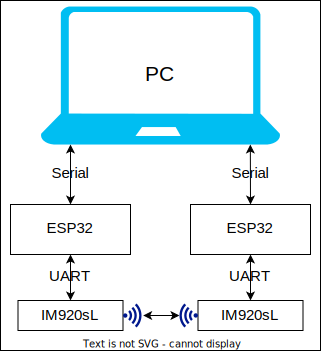
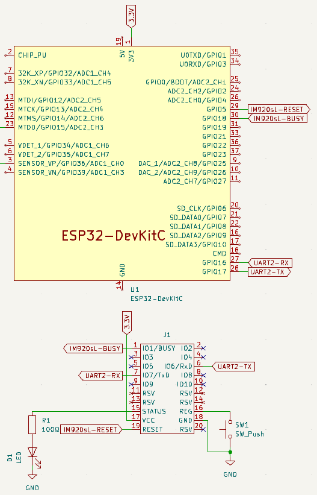
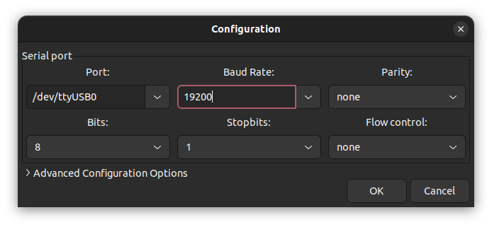
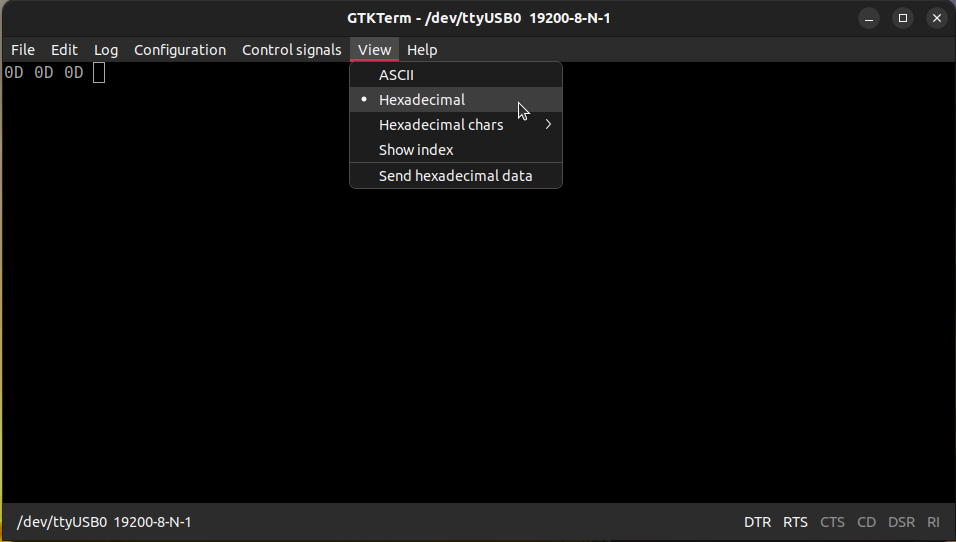
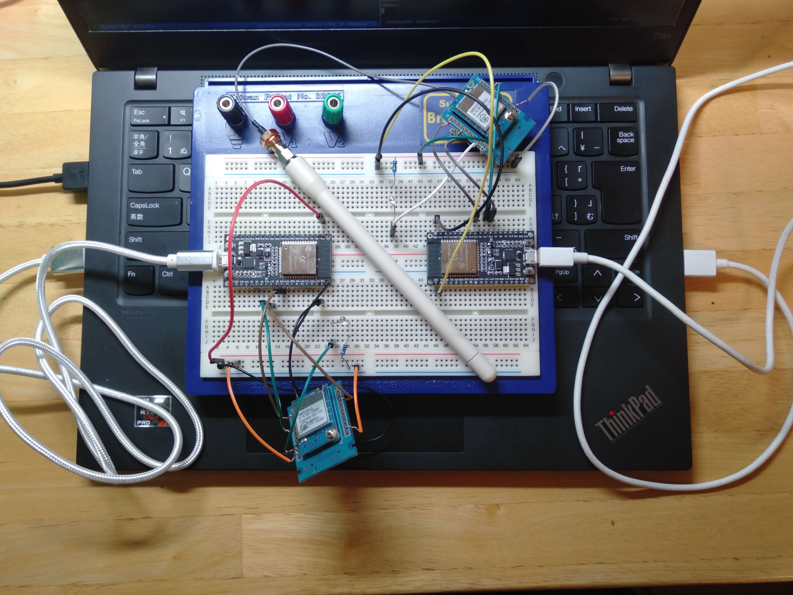

## 概要
ロケットに搭載する無線モジュールをIM920sLにすることになり、IM920sLをESP32で動かすことに挑戦しました。そのときの流れを忘れないように記しました。  
この記事では、以下の構成でIM920sLが双方向通信する方法を紹介しています。



## 環境
すでにESP32の開発環境が整っていることを前提としています。
- PC:Ubuntu
- マイコン:ESP32
- IDE:platformio

## ツールのインストール
PCとESP32がシリアル通信するために必要なツールをインストールします。Windowsを使っている人はTeraTermを使う人が多いみたいです。今回はUbuntuを使っているので、GTKTermというツールを使うことにしました。

```shell
sudo apt install gtkterm
```

## 配線
PC、ESP32、IM920sLを下のような構成にします。PCとESP32はUSBで接続し、ESP32とIM920sLは以下の回路図のように接続します。




## 初期設定とペアリング
### GTKTermの設定
シリアル通信ソフトのGTKTermを以下のような手順で設定します。
- GTKTermを開き、「Configuration -> Port」をクリックし、以下のような設定を行う
- また「View -> Local echo」をクリックする



### プログラムの書き込み
以下のプログラムをESP32に書き込みます。書き込み時にはGTKTermでシリアルポートを閉じなければいけません。F6キーで閉じることができます。

```c
#include <Arduino.h>
#include <stdio.h>

#define IM920_BUSY 18

HardwareSerial PCSerial(0);
HardwareSerial IM920Serial(2);

void setup() {
  // PC Serial
  PCSerial.begin(19200);
  PCSerial.setTimeout(10000);

  // IM920sL Serial
  pinMode(IM920_BUSY, INPUT);
  IM920Serial.begin(19200);
}

void loop() {
    // Nothing
}
```

### 改行コードの確認
ここで使用しているパソコンの改行コードを確認します。改行コードによってプログラムを少し変更する必要があります。
- GTKTermの「View -> Hexadecimal」を選択し、「Enterキー」を入力する
- 「`0D`」と表示されれば`<CR>`方式で、「`0D 0A`」と表示されれば`<CR><LF>`方式で、「`0A`」と表示されれば`<LF>`方式である
- 各方式に合わせてloop()関数の中身を以下のように書き換え、プログラムをESP32に書き込む



`<CR>`方式の場合
```c
void loop() {
  while(PCSerial.available()){
    if(digitalRead(IM920_BUSY) == LOW){
      IM920Serial.println(PCSerial.readStringUntil('\r'));
      PCSerial.println();
    }
  }
  while(IM920Serial.available()){
    PCSerial.println(IM920Serial.readStringUntil('\n'));
  }
}
```

`<CR><LF>`, `<LF>`方式の場合は準備中...

### IM920sLのペアリング
- 一応ざっと行ったことを下に示しますが、これ以降は[公式のクイックガイド](https://www.interplan.co.jp/support/solution/wireless/im920sl/manual/IM920sL_quick_start_guide.pdf)に記されているので、それ通りに進めたほうがよです。`> `はPCのキーボードで入力したことを意味しています。実際には表示されません。

```
> RDID
ooo1B15D
> ENWR
OK
> STNN 0001         # 親機のノード番号は0001を子機のノード番号は0002~FFFFの間で割り振る
OK
> RPRM              # 現在の設定内容を一覧で表示
....

> STGN              # 親機で実行:親機はグループ番号設定パケットの連続送信状態へ
OK

> STGN              # 子機で実行:親機のグループ番号設定パケットを受信できれば、親機のグループ番号を記録する
OK
GRNOREGD            # GRNOREGDが表示されれば成功
```

## データの送受信
最終的にこんな感じに配線をし、双方向通信を行いました。ピンヘッダが無かったので強引に配線していますが、こんな配線はよくないので、真似をしないでください....




上側のウィンドウが写真の左側のESP32とのシリアル通信の様子。下側のウィンドウが写真の右側のESP32とのシリアル通信の様子です。



